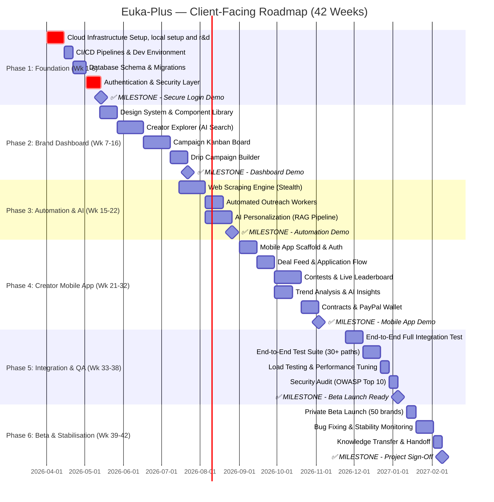

# 5. Project Roadmap, Delivery Plan & Effort Estimation

> **Cross-References:** Sprint deliverables are directly traceable to [04 — User Stories](./04_user_stories.md), implemented using the architecture from [03 — Tech Architecture](./03_technical_architecture.md), and validated against NFRs from [10 — NFRs](./10_nfr_and_compliance.md). Operational monitoring follows [11 — Developer Operations](./11_developer_operations.md).

---

## 5.1 Executive Summary

| Parameter | Value |
|:---|:---|
| **Total Duration** | 42 weeks (~10.5 months) |
| **Development Approach** | Agile Scrum — 2-week sprints, 21 sprints total |
| **Team Size** | 4.5 FTE (to be decided offline) |
| **First Usable Demo** | Week 14 — Brand Dashboard with working Explorer + Kanban |
| **Beta Launch** | Week 38 — Private Beta with 50 brands, 500 creators |
| **Post-Launch Support** | Weeks 39–42 — Bug fixes + stability monitoring included |
| **Manpower Cost** | *To be decided offline between stakeholders* |
| **Infrastructure Cost (During Dev)** | ~₹18,800/month (~₹1,98,700 total for 42 weeks) |

> **Note:** This document intentionally excludes manpower cost — it will be finalised separately. Only infrastructure, tooling, and third-party service costs are listed here, optimised for **minimum spend during development** using free tiers, sandboxes, and dev-only plans wherever possible.

---

## 5.2 Phased Delivery Overview

The project is divided into **6 phases**, each ending with a **client demo** and a tangible, testable deliverable. The extended 42-week timeline allows for deeper QA, buffer weeks for feedback iterations, and a more relaxed pace reducing burnout risk.

---

## 5.3 Phase Details & Client Demos

### Phase 1: Foundation & Security (Weeks 1–6)
**What the client sees at the end:** A working login page, secure registration with Stripe billing, and role-based access (Admin/Member/Viewer).

| What Gets Built | Why It Matters | Client Demo |
|:---|:---|:---|
| Cloud infrastructure (AWS VPC, database, cache) | Secure, scalable foundation — everything runs on this | N/A (back-end only) |
| Full database schema (16 tables) | Every feature depends on this data layer | Schema diagram walkthrough |
| User registration + login + team invites | Brands can create accounts and invite their team | **Live demo:** Register → Login → Invite team member → Verify roles work |
| Role-based permissions (RBAC) | Viewers can't edit, Members can't delete, Admins control everything | **Live demo:** Login as each role, show what's visible/hidden |

**Client Deliverables:**
- ✅ Staging environment URL
- ✅ Working registration + login
- ✅ 3 user roles functioning correctly
- ✅ Stripe billing connected (Starter/Growth/Enterprise tiers)

---

### Phase 2: Brand Dashboard CRM (Weeks 7–16)
**What the client sees at the end:** The full Brand Dashboard — search creators, manage campaigns with drag-and-drop, and build automated outreach sequences.

| What Gets Built | Why It Matters | Client Demo |
|:---|:---|:---|
| Creator Explorer with AI search | Brands find creators by niche, GMV, engagement, location | **Live demo:** Search "Beauty + ₹8L+ GMV + Micro" → results in <1s |
| "Lookalike" search (find creators similar to @handle) | Powered by AI vector similarity — unique competitive advantage | **Live demo:** Enter top creator handle → see 50 similar profiles |
| Campaign Kanban Board (17-column pipeline) | Visual tracking of every creator relationship from scout → paid | **Live demo:** Drag cards between stages, see validation rules work |
| Drip Campaign Builder (visual flow editor) | Brands design multi-step automated DM/email sequences | **Live demo:** Build trigger → DM → wait 2 days → email → end |
| Brand Analytics dashboard with charts | KPIs, revenue charts, funnel visualization | **Live demo:** Dashboard with live data, CSV export |

**Client Deliverables:**
- ✅ Brand Dashboard fully functional on staging
- ✅ Explorer search with all filters working
- ✅ Kanban board with drag-drop validation
- ✅ Drip campaign visual builder (save + activate)
- ✅ KPI dashboard + CSV export

---

### Phase 3: Automation & AI Engine (Weeks 15–22)
**What the client sees at the end:** The DM engine sending real personalized messages, AI-generated content, and automated creator discovery.

| What Gets Built | Why It Matters | Client Demo |
|:---|:---|:---|
| Stealth web scraping engine | Collects creator profiles from Instagram without being blocked | **Demo:** Show 100 scraped profiles appearing in Explorer |
| Automated DM outreach workers | Sends personalized DMs at human-like intervals (45-310s jitter) | **Demo:** Activate a drip → watch DMs fire with proper delays |
| AI-powered DM personalization (RAG) | Each DM references the creator's actual recent videos | **Demo:** Show side-by-side: generic template vs. AI-personalized DM |
| Safety system | Rate limiting, cooldowns, opt-out detection | **Demo:** Trigger rate limit → show system auto-pausing |
| AI Vision scoring | AI rates creator content quality 1-10 | **Demo:** Show AI scores appearing on creator profiles |

**Client Deliverables:**
- ✅ Outreach engine sending DMs on real platforms
- ✅ AI personalization generating unique messages
- ✅ Rate limiting and safety rules verified
- ✅ Proxy failover working (primary → fallback)

---

### Phase 4: Creator Mobile App (Weeks 21–32)
**What the client sees at the end:** A complete iOS + Android app for creators — browse deals, apply, sign contracts, track earnings, and withdraw money.

| What Gets Built | Why It Matters | Client Demo |
|:---|:---|:---|
| Login (Instagram OAuth + Magic Link + Email) | Creators log in with one tap via their Instagram account | **Demo on device:** Instagram OAuth flow → landing on Home feed |
| Deal feed + application flow | Creators scroll, filter, and apply to opportunities | **Demo:** Apply to a campaign → see it appear on Brand's Kanban |
| Contests with live leaderboard | Gamified competitions with real-time ranking (via WebSocket) | **Demo:** Simulate a sale → watch rank update live on screen |
| Viral Trend tool with AI analysis | Creators discover what's trending and get AI content advice | **Demo:** Tap AI Analysis button → see 3-bullet insight in <8s |
| In-app contract signing (legal) | Legally binding e-signatures without leaving the app | **Demo:** Sign a contract → PDF appears on Brand's dashboard |
| PayPal wallet + instant withdrawals | Creators cash out earnings with one tap | **Demo:** Tap Withdraw → confirm → confetti → PayPal email received |

**Client Deliverables:**
- ✅ iOS TestFlight build
- ✅ Android APK for testing
- ✅ All 5 tabs working (Home, Contests, My Work, Trends, Profile)
- ✅ PayPal payouts processing real money (sandbox)
- ✅ Push notifications firing on key events

---

### Phase 5: Integration, QA & Hardening (Weeks 33–38)
**What the client sees at the end:** A production-ready platform, fully tested, secured, and deployed.

| What Gets Built | Why It Matters | Client Demo |
|:---|:---|:---|
| Full integration testing (all services together) | Ensures Brand Dashboard + Mobile App + AI + Outreach talk to each other perfectly | **Demo:** End-to-end flow: Brand scouts → DM sent → Creator applies → Contract signed → Paid |
| 30+ automated E2E test scenarios | Every critical user path tested automatically | **Demo:** Run tests → all green |
| Load testing (10k concurrent users on leaderboard) | Proves the platform won't crash under real traffic | **Demo:** Load test report showing all SLA targets met |
| OWASP Top 10 security audit | No critical vulnerabilities before launch | **Demo:** Clean audit report |
| All 19 notification types verified | Emails, push notifications, and in-app alerts all work | **Demo:** Trigger each notification type → verify receipt |

**Client Deliverables:**
- ✅ All tests passing (E2E + load + security)
- ✅ iOS App Store submission-ready
- ✅ Android Play Store submission-ready
- ✅ Production environment provisioned

---

### Phase 6: Beta Launch & Stabilisation (Weeks 39–42)
**What the client sees at the end:** A live production platform with real users, monitored and stable.

| What Gets Built | Why It Matters | Client Demo |
|:---|:---|:---|
| Production deployment + monitoring dashboards | Live platform with real-time health tracking | **Demo:** Production URL live with monitoring dashboards |
| Private Beta (50 brands, 500 creators) | Real users on real data — find edge cases before public launch | **Demo:** Show real brand usage, real creator signups |
| Bug fixing from Beta feedback | Polish based on real-world usage | **Demo:** Issue tracker → all P0/P1 bugs resolved |
| Full knowledge transfer & documentation handoff | Client's team (or next team) can maintain and extend the platform | **Demo:** Handoff session with documentation walkthrough |

**Client Deliverables:**
- ✅ Production URL live
- ✅ Monitoring dashboards (uptime, performance, errors)
- ✅ Full hand-off documentation
- ✅ All Beta bugs resolved
- ✅ Source code access + deployment runbook

---

## 5.4 Team Composition & Effort Estimation

> **Note:** Manpower rates and total team cost are to be finalised offline between the client and the development team. This section only documents the **roles, effort in person-weeks**, and **which phases each role is active in**.

### Team Roles & Effort
| Role | Count | Active Phases | Effort (Person-Weeks) |
|:---|:---:|:---|:---:|
| Lead Architect / Tech Lead | 1 | All Phases (1–6) | 42 |
| Frontend Engineer (Next.js) | 1 | Phase 1–3, 5 (Weeks 1-22, 33-38) | 28 |
| Backend Engineer (Node.js) | 1 | Phase 1–5 (Weeks 1-38) | 38 |
| Data / AI Engineer (Python) | 1 | Phase 2–4 (Weeks 7-32) | 26 |
| Mobile Engineer (Flutter) | 1 | Phase 4–5 (Weeks 21-38) | 18 |
| QA Engineer | 0.5 | Phase 5–6 (Weeks 33-42) | 10 |
| **Total Effort** | | | **162 person-weeks** |

---

## 5.5 Infrastructure & Third-Party Costs During Development (₹ INR)

The strategy during development is to **minimise spend** by using free tiers, sandbox environments, and pay-as-you-go plans. Production-grade infrastructure is only provisioned in Phase 5.

### Development Phase (Weeks 1–38): Minimum Viable Infrastructure

| Service | Free Tier / Dev Plan | Monthly Cost (₹) | 9.5 Month Total (₹) | Notes |
|:---|:---|:---:|:---:|:---|
| **AWS (Dev/Staging)** | RDS `db.t3.micro` (free tier 12 mo) + ElastiCache `cache.t3.micro` + t3.micro ECS | ₹3,500 | ₹33,250 | AWS Free Tier covers first 12 months of RDS. ECS Fargate charged per vCPU-hour. Dev = single AZ, no Multi-AZ redundancy |
| **Vercel** | Free plan (Hobby) | ₹0 | ₹0 | Unlimited deploys; 100GB bandwidth; sufficient for staging |
| **OpenAI API** | Pay-as-you-go; `gpt-4o-mini` | ₹1,500 | ₹14,250 | Low volume during dev — only used when testing AI features. ~₹12/1000 DMs |
| **Pinecone (Vector DB)** | Starter plan (free) | ₹0 | ₹0 | N/A (Switching to pgvector on existing RDS) |
| **Webshare Proxies** | Base plan for testing | ₹1,200 | ₹11,400 | Replaces BrightData for scraper dev |
| **IPRoyal (Fallback)** | Not needed during dev | ₹0 | ₹0 | Only activate for production |
| **Amazon SES (Email)** | AWS Free Tier (62k/mo) | ₹0 | ₹0 | Replaces SendGrid |
| **Docuseal API** | Self-hosted Docker (free) | ₹0 | ₹0 | Runs on existing ECS cluster (replaces DropBox Sign) |
| **EasyPost (Shipping)** | Test mode (free) | ₹0 | ₹0 | Test environment; no real shipments |
| **PayPal Payouts** | Sandbox (free) | ₹0 | ₹0 | Full sandbox available; no real money moved during dev |
| **Stripe** | Test mode (free) | ₹0 | ₹0 | No charges on test keys |
| **GlitchTip (Error Tracking)** | Self-hosted (free) | ₹0 | ₹0 | Runs on existing ECS cluster (replaces Sentry) |
| **GitHub** | Free for private repos | ₹0 | ₹0 | GitHub Actions: 2000 mins/month free |
| **Firebase (Push Notifications)** | Free tier (FCM) | ₹0 | ₹0 | FCM is free for unlimited push notifications |
| **Google Maps API** | $200/month free credit | ₹0 | ₹0 | Free credit covers ~28k geocode calls/month |
| **Docker Hub** | Free plan | ₹0 | ₹0 | |
| **Domain Name** | eukaplus.com or similar | ₹1,000 | ₹1,000 | One-time purchase |
| **SSL Certificate** | Let's Encrypt (free) / Cloudflare | ₹0 | ₹0 | |
| **Cloudflare** | Free plan | ₹0 | ₹0 | DNS + basic CDN + basic WAF included free |
| **Apple Developer Account** | Annual | ₹8,500 | ₹8,500 | Required for TestFlight + App Store (one-time annual) |
| **Google Play Developer** | Lifetime | ₹2,100 | ₹2,100 | One-time registration fee (₹2,100 / $25) |
| | | | | |
| **Monthly Recurring (During Dev)** | | **~₹6,200/mo** | | |
| **One-Time Costs** | | | **₹11,600** | Domain + Apple + Google |
| **TOTAL (Dev Phase — 9.5 Months)** | | | **~₹70,500** | |

### Production Phase (Weeks 39–42+): Full Infrastructure

*These costs kick in only when going live. This is the monthly cost after launch.*

| Service | Production Plan | Monthly Cost (₹) | Notes |
|:---|:---|:---:|:---|
| AWS (Production Multi-AZ) | RDS `db.r6g.large` Multi-AZ + ElastiCache cluster + ECS Fargate | ₹35,000 | Multi-AZ for high availability |
| Vercel | Hobby Plan (until 100GB limit) | ₹0 | Upgrade to Pro (₹1,700) only when traffic spikes |
| OpenAI API | At scale (10k DMs/month) | ₹9,200 | See [06 — Cost Model](./06_ai_and_integrations.md#613-token-cost-model) |
| pgvector (Vector DB) | PostgreSQL Extension | ₹0 | Replaces Pinecone (runs on existing RDS) |
| Webshare / Proxy-Cheap | 100-250 Datacenter / 5GB Res | ₹3,000 | Replaces BrightData |
| IPRoyal / AsdlProxy | Fallback proxy pool | ₹1,500 | Replaces Smartproxy |
| Amazon SES | 100k emails/mo | ₹850 | First 62k free via EC2/ECS. Replaces SendGrid |
| Docuseal API | Self-hosted Docker container | ₹0 | Runs on existing ECS. Replaces DropBox Sign |
| GlitchTip & Grafana | Self-hosted observability | ₹0 | Runs on existing ECS. Replaces Sentry/Datadog |
| Cloudflare | Free plan | ₹0 | Sufficient for initial launch |
| **TOTAL (Monthly Post-Launch)** | | **~₹49,550/mo** | |

### Cost Summary
| Period | Duration | Total Estimated Cost (₹) |
|:---|:---|:---:|
| **Development Phase** (minimal infra) | Weeks 1–38 (~9.5 months) | **~₹70,500** |
| **Production Phase** (full infra) | Weeks 39–42 (1 month) | **~₹49,550** |
| **Grand Total (Infrastructure Only)** | 42 weeks | **~₹1,20,050** |

> **Note:** All costs are approximate and based on March 2026 pricing at ₹84/USD. Actual costs may vary by 10-15% depending on usage patterns. Manpower cost is excluded and will be discussed separately.

---

## 5.6 Delivery Milestone Schedule

| Milestone | Week | Deliverable Proof |
|:---|:---:|:---|
| **Project Kickoff** | 0 | Repository created, staging URL provisioned, team onboarded |
| **Phase 1 Complete** — Auth & RBAC | 6 | Working login demo on staging; 3 roles verified |
| **Phase 2 Complete** — Brand Dashboard | 16 | Full dashboard demo: Explorer, Kanban, Drip Builder, Analytics |
| **Phase 3 Complete** — Automation Engine | 22 | Live outreach demo: AI-personalized DMs being sent |
| **Phase 4 Complete** — Creator Mobile App | 32 | TestFlight (iOS) + APK (Android) with all 5 tabs working |
| **Phase 5 Complete** — QA & Hardening | 38 | All tests passing + security audit + load test report |
| **Phase 6 Complete** — Beta & Sign-Off | 42 | Production live + 4 weeks of stable Beta + handoff done |

---

## 5.7 Sprint-Level Task Breakdown (Technical)

*This section is for the development team. The client may skip this section.*

### Sprint 1-3 (Week 1-6): Infrastructure & Auth
| Task ID | Task | Owner | Deliverable | Definition of Done |
|:---|:---|:---|:---|:---|
| S1-01 | Create Terraform manifests (VPC, subnets, RDS, Redis, ECR, S3) | Tech Lead | `infra/terraform/` | `terraform apply` provisions all resources in staging |
| S1-02 | Create Docker Compose for local dev (PostgreSQL, Redis) | Tech Lead | `docker-compose.yml` | `docker compose up` boots local DB |
| S1-03 | GitHub Actions CI/CD pipelines | Tech Lead | `.github/workflows/` | Green pipeline on initial commit |
| S1-04 | Initialize monorepo structure (Turborepo) | Tech Lead | `apps/web`, `apps/api`, `packages/shared` | `turbo run build` succeeds |
| S2-01 | Database schema matching [03 — Schema](./03_technical_architecture.md#33-complete-database-schema-postgresql-16) | Backend | ORM schema file | Migrations run clean |
| S2-02 | JWT Auth (Access + Refresh tokens) per [NFR-SEC004](./10_nfr_and_compliance.md) | Backend | Auth module | Login returns HTTP-Only cookies |
| S3-01 | RBAC Guard middleware per [RBAC Matrix](./08_business_rules_and_rbac.md#brand-dashboard-permissions) | Backend | Roles guard | Viewer cannot POST → 403 |
| S3-02 | Multi-tenant isolation middleware | Backend | Tenant interceptor | Cross-tenant access returns 403 |
| S3-03 | Brand Registration per Story [1.1](./04_user_stories.md#story-11-brand-registration) | Backend + Frontend | Registration page | All 4 ACs pass |

### Sprint 4-8 (Week 7-16): Brand Dashboard CRM
| Task ID | Task | Owner | Deliverable | Definition of Done |
|:---|:---|:---|:---|:---|
| S4-01 | Build design system (theme, typography, components) | Frontend | Component library | Storybook deployed |
| S4-02 | Explorer Search page per [Screen 7.3](./07_screen_specifications.md) | Frontend + Backend | Explorer page | All filters work; < 800ms latency |
| S5-01 | Lookalike Vector Search (pgvector) | Data Engineer | Lookalike API | Top 50 similar creators returned |
| S6-01 | Kanban Board per [Screen 7.4](./07_screen_specifications.md) | Frontend | Kanban page | Drag-drop with optimistic UI + rollback |
| S6-02 | Creator Side Panel (profile, history, notes) | Frontend | Panel component | Auto-saves notes on blur |
| S7-01 | State transition validation per [State Machine 8.2](./08_business_rules_and_rbac.md) | Backend | Transition API | Invalid transitions return 422 |
| S7-02 | Drip Campaign Builder UI per [Screen 7.5](./07_screen_specifications.md) | Frontend | Flow editor page | DAG serializes and validates |
| S8-01 | Brand Analytics + CSV Export per [Screen 7.14](./07_screen_specifications.md) | Frontend + Backend | Analytics page | Charts render; CSV downloads correctly |

### Sprint 8-11 (Week 15-22): Automation Engine
| Task ID | Task | Owner | Deliverable | Definition of Done |
|:---|:---|:---|:---|:---|
| S8-02 | Stealth browser scraping cluster | Data Engineer | Scraper service | Successful Instagram profile scrape |
| S9-01 | Proxy rotation + failover | Data Engineer | Proxy manager | IP rotates on 403/429 |
| S9-02 | Outreach worker architecture (Redis + Celery) | Data Engineer + Backend | Outreach service | Worker sends DM with jitter delay |
| S10-01 | Outreach safety rules per [OR-001 to OR-006](./08_business_rules_and_rbac.md) | Backend | Rate limiter | All 6 rules verified |
| S10-02 | AI RAG pipeline per [06 — AI](./06_ai_and_integrations.md#61-the-rag-architecture-retrieval-augmented-generation) | Data Engineer | AI service | Personalized DM generated < 3s |
| S11-01 | AI Vision scoring pipeline per [06 — Vision](./06_ai_and_integrations.md#62-ai-vision-scoring-pipeline) | Data Engineer | Vision cron | Creator profiles scored nightly |

### Sprint 11-16 (Week 21-32): Creator Mobile App
| Task ID | Task | Owner | Deliverable | Definition of Done |
|:---|:---|:---|:---|:---|
| S11-02 | Flutter app scaffold (state mgmt, routing, storage) | Mobile | Mobile app | Compiles on iOS + Android |
| S12-01 | Instagram OAuth login flow | Mobile + Backend | Login screen | Token stored securely |
| S12-02 | Deal Feed per [Screen 7.7](./07_screen_specifications.md) | Mobile | Home tab | Infinite scroll, filter pills |
| S13-01 | Contest Leaderboard per [Screen 7.8](./07_screen_specifications.md) | Mobile + Backend | Contests tab | Real-time WebSocket updates |
| S13-02 | Trends + AI Analysis per [Screen 7.10](./07_screen_specifications.md) | Mobile + Data Engineer | Trends tab | LLM call with caching |
| S14-01 | My Work tab per [Screen 7.9](./07_screen_specifications.md) | Mobile | My Work tab | All 4 sub-tabs with empty/loaded states |
| S15-01 | In-App E-Signature per [06 — Docuseal](./06_ai_and_integrations.md) | Mobile + Backend | Contract flow | Webhook updates DB; PDF hashed |
| S16-01 | PayPal Wallet per [FR-001 to FR-008](./08_business_rules_and_rbac.md) | Mobile + Backend | Wallet screen | All 4 ACs from [Story 4.2](./04_user_stories.md) pass |
| S16-02 | Push notification system + deep links | Mobile + Backend | Notification system | All push types from [09 — Notifications](./09_notifications_and_emails.md) verified |

### Sprint 17-19 (Week 33-38): Integration, QA & Hardening
| Task ID | Task | Owner | Deliverable | Definition of Done |
|:---|:---|:---|:---|:---|
| S17-01 | Full end-to-end integration testing | QA + All | Integration report | All services communicating correctly |
| S17-02 | E2E test suite (30+ critical paths) | QA + Frontend | Test suite | All tests green in CI |
| S18-01 | Load test (10k concurrent users) | QA + Backend | Load test report | All [NFR-P targets](./10_nfr_and_compliance.md) met |
| S19-01 | OWASP Top 10 security audit | Tech Lead | Audit report | Zero HIGH/CRITICAL findings |
| S19-02 | Notification system verification | QA | Test report | All 19 notification types verified |
| S19-03 | App Store / Play Store submission | Mobile | Store listings | Submitted for review |

### Sprint 20-21 (Week 39-42): Beta & Stabilisation
| Task ID | Task | Owner | Deliverable | Definition of Done |
|:---|:---|:---|:---|:---|
| S20-01 | Production deployment + monitoring | Tech Lead | Production URL live | Monitoring dashboards active |
| S20-02 | Private Beta launch (50 brands, 500 creators) | All | Beta programme | Real users onboarded |
| S21-01 | Bug fixing from Beta feedback | All | Bug fix releases | All P0/P1 bugs resolved |
| S21-02 | Performance tuning from monitoring data | Backend + Tech Lead | Optimisation report | Slow queries fixed |
| S21-03 | Knowledge transfer & documentation handoff | Tech Lead | Handoff package | Dev environment setup guide, deployment runbook, API docs |

---

## 5.8 Risk & Contingency Plan

| # | Risk | Impact | Mitigation | Buffer |
|:---|:---|:---|:---|:---:|
| 1 | Instagram aggressively updates Graph API rate limits or anti-bot protections | Scraper breaks, blocking Phase 3 | Maintain 3 scraping strategies (Graph API, Playwright, manual CSV) | +2 weeks |
| 2 | Delayed App Store review (iOS) | Beta launch delayed | Submit 3 weeks early; prepare for rejection appeal | +3 weeks |
| 3 | OpenAI API price increase or rate limit changes | AI features become costly | Cache aggressively; fall back to `gpt-4o-mini` for all calls | +0 weeks |
| 4 | Key team member unavailable mid-project | Knowledge gap, sprint delay | Comprehensive documentation + pair programming from Week 1 | +2 weeks |
| 5 | PayPal Payouts API approval delayed | Wallet feature blocked | Pre-apply in Week 1; use Stripe Connect as backup | +1 week |
| 6 | Scope creep from additional feature requests | Timeline extends | All changes go through formal Change Request process | Variable |
| 7 | Third-party API breaking changes (Instagram Graph API, YouTube) | Integration rework needed | Abstract all external APIs behind adapter pattern | +2 weeks |
| 8 | Client feedback iterations take longer than expected | Phase delivery delayed | Buffer weeks built into 42-week timeline | Already included |

---

## 5.9 Definition of Done (Global)

Every task must satisfy ALL of the following before being marked complete:

1. ✅ Code is peer-reviewed and merged via Pull Request.
2. ✅ Unit tests written (minimum 80% coverage on new code).
3. ✅ No debug statements (`console.log`, `print()`) in merged code.
4. ✅ API endpoints documented in Swagger/OpenAPI spec.
5. ✅ Relevant acceptance criteria from [04 — User Stories](./04_user_stories.md) are verified.
6. ✅ No HIGH/CRITICAL dependency vulnerabilities (Snyk scan passes).
7. ✅ Responsive on all breakpoints defined in [10 — Compatibility](./10_nfr_and_compliance.md#107-browser--device-compatibility-matrix).
8. ✅ Accessibility audit passed (WCAG 2.1 AA per [NFR-ACC](./10_nfr_and_compliance.md#106-accessibility-requirements-wcag-21-aa)).

---
