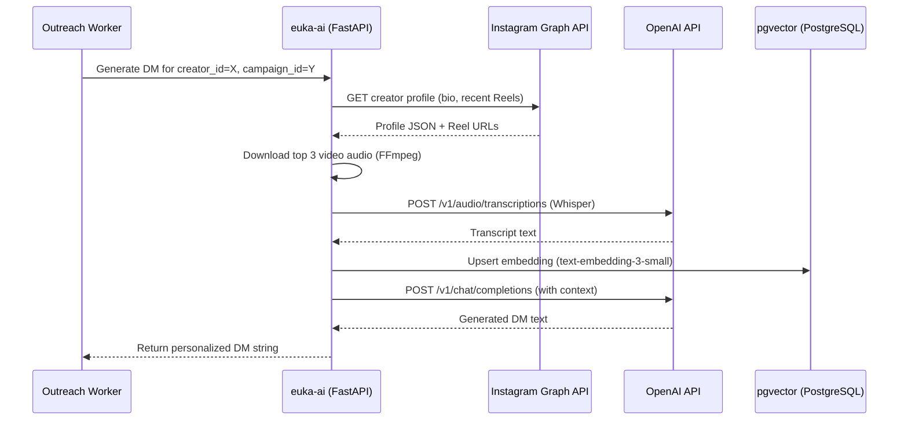

# 6. AI, API & Stealth Operations Specification

> **Cross-References:** These integrations power the features in [02 — Features](./02_core_features.md), are called from the services defined in [03 — Architecture](./03_technical_architecture.md), and trigger notifications defined in [09 — Notifications](./09_notifications_and_emails.md).

---

## 6.1 The RAG Architecture (Retrieval-Augmented Generation)
*Powers: Feature [2.2 — Automated Outreach](./02_core_features.md#22-the-automated-outreach-engine-drip-campaigns) | Service: `euka-ai` (port 8003)*

### 6.1.1 Context Preparation Pipeline



### 6.1.2 Prompt Template (Exact)
```
SYSTEM:
You are a warm, Gen-Z affiliate marketer for {brand.name}. Rules:
- Tone: Casual, like a friend texting. Minimal punctuation.
- Never start with "Dear", "Hello", "Hi there", or "Hope you're well".
- Use 1-2 emojis max. Never use 🙏 or 💼.
- Max 3 sentences.
- Must reference something specific from the creator's recent content.
- Must mention the product naturally, not as a sales pitch.
- End with a soft CTA (question, not a command).

USER:
Brand: {brand.name} — {brand.industry}
Product: {campaign.product_name} ({campaign.commission_rate}% commission)
Creator: @{creator.instagram_handle}
Creator's recent video topics: {transcript_summary_1}, {transcript_summary_2}
Creator's bio: {creator.bio}

Write 1 personalized DM.
```

### 6.1.3 Token Cost Model
| Model | Use Case | Cost per 1M Tokens | Estimated Monthly Cost (10k DMs/mo) |
|:---|:---|:---|:---|
| `gpt-4o-mini` | Bulk DM generation | $0.15 input / $0.60 output | ~$12/mo |
| `whisper-1` | Audio transcription | $0.006 / minute | ~$45/mo (500 min) |
| `text-embedding-3-small` | Lookalike vector creation | $0.02 | ~$2/mo |
| `gpt-4o` | AI Trend Analysis (creator-facing) | $2.50 input / $10.00 output | ~$50/mo (with caching) |
| **Total** | | | **~$109/month** |

---

## 6.2 AI Vision Scoring Pipeline
*Powers: Feature [2.1 — Explorer AI Score](./02_core_features.md#211-the-ui-query-builder) | Runs as: Nightly cron job in `euka-ai`*

### 6.2.1 Process
1. Cron selects creators where `ai_quality_score IS NULL` or `scored_at < NOW() - INTERVAL '30 days'` (batch of 200/night).
2. Python downloads 5 keyframe thumbnails from each creator's top video via FFmpeg: `ffmpeg -i video.mp4 -vf "select=eq(ptype,I)" -frames:v 5 thumb_%02d.jpg`.
3. Images encoded as Base64, sent to `gpt-4o` (Vision):
```
Analyze these 5 video frames. Rate 1-10 on:
1. Lighting Quality
2. Camera Focus / Stability
3. Background Clutter (10 = clean)
4. Color Grading / Aesthetic
Return strict JSON: {"lighting":X,"focus":X,"background":X,"color":X,"overall":X}
```
4. `creators.ai_quality_score` updated with `overall` value.

---

## 6.3 Viral Wave Trend Engine
*Powers: Feature [2.4.4 — Trend Tool](./02_core_features.md#244-viral-wave-trend-tool) | Screen: [7.10](./07_screen_specifications.md) | RBAC: [Creator limits](./08_business_rules_and_rbac.md#creator-app-permissions)*

### 6.3.1 Data Collection (Cron: Every 6 Hours)
1. Python queries Instagram Graph API trending hashtags and product tags: `GET /api/v1/trends/instagram?period=7d`.
2. For each product keyword, calculates: `growth_rate = (gmv_this_week - gmv_last_week) / gmv_last_week * 100`.
3. Keywords with `growth_rate > 300%` saved to `trending_keywords` table.
4. Also scrapes Amazon Best Sellers API (PAAPI) for cross-platform validation.

### 6.3.2 AI Analysis Endpoint
*   **API:** `POST /api/v1/trends/:id/ai-analysis`
*   **Rate Limiting:** Free: 5/day (checked via Redis counter `creator:{id}:ai_calls:{date}`). VIP: Unlimited.
*   **Caching:** Response stored in `trending_keywords.ai_analysis_cache` (JSONB) with application-side TTL of 1 hour.
*   **LLM Prompt:**
    ```
    Analyze why the product keyword "{keyword}" is trending on {platform}.
    Return strict JSON:
    {
      "hook": "The specific content format or hook driving views",
      "demographic": "The primary audience demographic engaging",
      "audio": "The trending audio/sound being used, if any"
    }
    ```

---

## 6.4 Stealth Operations: Bypassing Anti-Bot Systems
*Powers: Feature [2.2 — Outreach Worker](./02_core_features.md#222-execution-engine-worker) | Service: `euka-scraper` (port 8001) + `euka-outreach` (port 8002)*

### 6.4.1 Playwright Stealth Configuration
```python
# playwright_config.py (apps/scraper/config/)
STEALTH_ARGS = [
    "--disable-blink-features=AutomationControlled",
    "--disable-features=IsolateOrigins,site-per-process",
    "--disable-dev-shm-usage",
    f"--proxy-server={PROXY_ENDPOINT}",
]

CONTEXT_OPTIONS = {
    "viewport": {"width": random.randint(1280, 1920), "height": random.randint(720, 1080)},
    "user_agent": ua_rotator.get_random(),  # Rotates from pool of 500+ real Chrome UAs
    "locale": "en-US",
    "timezone_id": "America/New_York",
    "geolocation": {"latitude": 40.7128, "longitude": -74.0060},  # Match proxy region
}
```

### 6.4.2 Human Emulation Rules
| Action | Human Approach | Bot Approach (AVOID) |
|:---|:---|:---|
| Navigation | Scroll organically (random offsets, pauses) | Direct `page.goto()` |
| Clicking | Bezier curve mouse path + random overshoot | `element.click()` |
| Typing | `page.type(sel, text, delay=random(80,150))` | `page.fill(sel, text)` — instant |
| Waiting | `random(3000, 8000)` ms between actions | Fixed 1000ms delays |
| Session | Max 45 min per session; re-login with fresh context | Infinite session |

### 6.4.3 Proxy Architecture
| Layer | Provider | Purpose | Monthly Cost |
|:---|:---|:---|:---|
| Primary | Webshare | All scraping + DM sending | ~$15-30/mo |
| Fallback | IPRoyal / AsdlProxy | Auto-failover if Webshare quota exceeded | ~$15/mo |
| Development | Free datacenter proxies | Local testing only (blocked by production platforms) | $0 |

*   **Failover Logic:** If Webshare returns 407 (Proxy Auth Failed) or connection timeout, `ProxyManager` class auto-switches all active workers to IPRoyal endpoint within 30 seconds.

---

## 6.5 External API Contracts (Request/Response)

### 6.5.1 PayPal Payouts API
*Powers: Screen [7.11 — Wallet](./07_screen_specifications.md) | Rules [FR-001 to FR-008](./08_business_rules_and_rbac.md) | Notification [P-007, E-003](./09_notifications_and_emails.md)*

```http
POST https://api-m.paypal.com/v1/payments/payouts
Authorization: Bearer {access_token}
Content-Type: application/json

{
  "sender_batch_header": {
    "sender_batch_id": "EUKA_{ledger_transaction_id}",
    "email_subject": "You have a payout from Euka-Plus!",
    "email_message": "You earned this from your latest collab."
  },
  "items": [{
    "recipient_type": "EMAIL",
    "amount": { "value": "47.50", "currency": "USD" },
    "note": "Commission: Summer Glow Campaign",
    "sender_item_id": "{creator_uuid}_{collab_id}",
    "receiver": "{creator.paypal_email}"
  }]
}
```
**Response:** `201 Created` → `batch_header.payout_batch_id` saved to `ledger_transactions.paypal_payout_item_id`.

### 6.5.2 Docuseal API (Self-Hosted E-Signature)
*Powers: Feature [2.4.2](./02_core_features.md) | Story [5.1](./04_user_stories.md)*

```http
POST https://docuseal.eukaplus.com/api/submissions
Authorization: Bearer {DOCUSEAL_API_KEY}

{
  "template_id": "{DOCUSEAL_TEMPLATE_ID}",
  "send_email": false,
  "submitters": [
    {
      "email": "{creator.email}",
      "role": "Creator"
    }
  ]
}
```
**Response:** `200 OK` → `[0].slug` → used to generate `embed_url` for Flutter WebView.

### 6.5.3 EasyPost Tracking Webhook
*Powers: Feature [2.3.2 — Logistics](./02_core_features.md) | Notification [P-003, P-004, P-005](./09_notifications_and_emails.md)*

```http
POST /api/webhooks/easypost (incoming)

{
  "result": {
    "id": "trk_ABC123",
    "tracking_code": "9400111234",
    "status": "delivered",  // or "in_transit", "return_to_sender", "failure"
    "carrier": "USPS",
    "tracking_details": [{
      "status": "delivered",
      "datetime": "2026-05-15T14:30:00Z",
      "message": "Delivered to front door"
    }]
  }
}
```
**Backend Response Logic:**
| Incoming `status` | DB Update | Next Action | Notification |
|:---|:---|:---|:---|
| `in_transit` | `collaborations.current_stage = SAMPLE_SHIPPED` | — | Push [P-003](./09_notifications_and_emails.md) |
| `delivered` | `collaborations.current_stage = SAMPLE_DELIVERED` | Start 3-day Redis timer | Push [P-004](./09_notifications_and_emails.md) |
| `return_to_sender` | `collaborations.current_stage = SHIPPING_EXCEPTION` | — | Email to brand + creator |
| `failure` | `collaborations.current_stage = SHIPPING_EXCEPTION` | — | Email to brand + creator |

---
