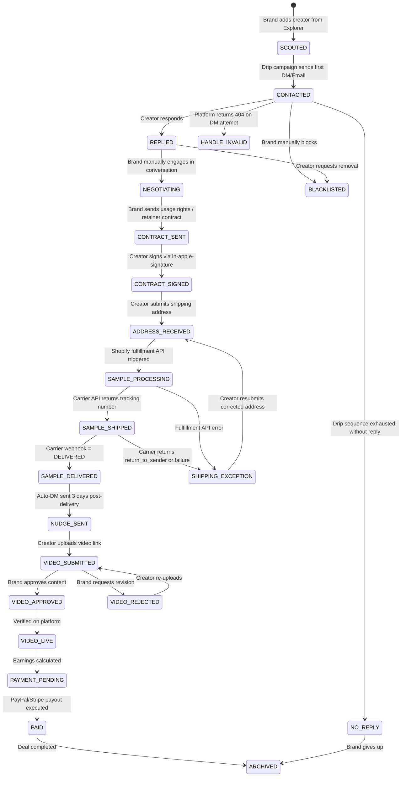
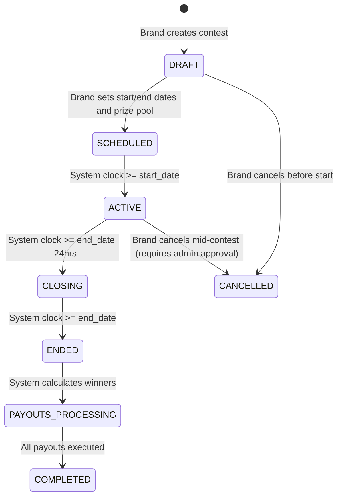

# 8. Business Rules Engine, State Machines & RBAC Matrix

This document codifies every business rule, state transition, and permission boundary in the system. No logic should be "assumed" — it must be explicitly defined here.

---

## 8.1 RBAC (Role-Based Access Control) Permission Matrix

### Brand Dashboard Permissions

| Capability | SuperAdmin | Member | Viewer |
|:---|:---:|:---:|:---:|
| View Dashboard KPIs | ✅ | ✅ | ✅ |
| View Explorer / Search Creators | ✅ | ✅ | ✅ |
| Add Creators to Campaigns | ✅ | ✅ | ❌ |
| Create New Campaigns | ✅ | ✅ | ❌ |
| Delete Campaigns | ✅ | ❌ | ❌ |
| Configure Drip Campaign Sequences | ✅ | ✅ | ❌ |
| Activate / Deactivate Drip Campaigns | ✅ | ✅ | ❌ |
| Move Creator Cards on Kanban | ✅ | ✅ | ❌ |
| View Outreach Message Content | ✅ | ✅ | ❌ |
| View Shipping Addresses (Unmasked) | ✅ | ❌ | ❌ |
| View Analytics Dashboards | ✅ | ✅ | ✅ |
| Export CSV Reports | ✅ | ✅ | ✅ |
| Manage Team Members (Invite/Remove) | ✅ | ❌ | ❌ |
| Change Subscription / Billing | ✅ | ❌ | ❌ |
| Access API Keys | ✅ | ❌ | ❌ |
| View Audit Logs | ✅ | ❌ | ❌ |
| Delete Brand Account | ✅ | ❌ | ❌ |

### Creator App Permissions
| Capability | Free Creator | VIP Creator |
|:---|:---:|:---:|
| Browse Home Feed | ✅ | ✅ |
| Apply to Collabs | ✅ (3/week limit) | ✅ (Unlimited) |
| Apply to Retainers | ❌ | ✅ |
| Join Contests | ✅ | ✅ |
| View Trends | ✅ | ✅ |
| Use AI Analysis | ✅ (5/day limit) | ✅ (Unlimited) |
| Withdraw to PayPal | ✅ (Min $10) | ✅ (Min $5) |
| Access Early Deal Previews | ❌ | ✅ (24hr early access) |
| Referral Program | ✅ ($15 bonus) | ✅ ($30 bonus) |

---

## 8.2 Collaboration State Machine
Every creator-brand relationship (`collaboration` row) follows a strict state machine. Transitions are validated server-side.

### Transition Validation Rules (Server-Side)
| From State → To State | Pre-Condition (Must Be True) | Auto-Action on Transition |
|:---|:---|:---|
| SCOUTED → CONTACTED | Drip campaign must be active for this campaign | Log first outreach timestamp |
| CONTACTED → REPLIED | System detects reply via API webhook or manual brand input | Pause drip sequence for this creator |
| CONTACTED → HANDLE_INVALID | DM send returns HTTP 404 (handle no longer exists) | Halt drip sequence; flag creator profile |
| CONTRACT_SENT → CONTRACT_SIGNED | `contracts.is_signed = TRUE` AND `contracts.signed_at IS NOT NULL` | Store PDF hash (SHA-256) in DB |
| ADDRESS_RECEIVED → SAMPLE_PROCESSING | `creators.address_json_encrypted IS NOT NULL` AND address validation passed (Google Maps API) | Trigger Shopify fulfillment API call |
| SAMPLE_SHIPPED → SAMPLE_DELIVERED | Carrier webhook status = `DELIVERED` | Start 3-day countdown timer in Redis |
| SAMPLE_SHIPPED → SHIPPING_EXCEPTION | Carrier webhook status = `return_to_sender` or `failure` | Auto-email brand + creator ([E-005](./09_notifications_and_emails.md)) |
| SHIPPING_EXCEPTION → ADDRESS_RECEIVED | Creator resubmits corrected address | Clear old tracking data; ready for re-fulfillment |
| SAMPLE_DELIVERED → NUDGE_SENT | 3 days elapsed since delivery timestamp | Auto-send DM via outreach engine |
| VIDEO_SUBMITTED → VIDEO_APPROVED | Brand user manually clicks "Approve" button | Calculate commission; insert `ledger_transaction` with status `PENDING` |
| PAYMENT_PENDING → PAID | PayPal API returns `status: SUCCESS` | Update `ledger_transaction.status = CLEARED`; send push notification |

---

## 8.3 Contest Lifecycle State Machine

### Contest Business Rules
| Rule ID | Rule | Implementation |
|:---|:---|:---|
| CR-001 | Prize pool must be fully funded (escrowed) before contest goes ACTIVE | Brand's Stripe payment intent must be `captured` for the full prize amount |
| CR-002 | Leaderboard updates in real-time during ACTIVE state | Redis Sorted Set (`ZADD contest:{id}:leaderboard {sales_count} {creator_id}`) updated on every sale webhook |
| CR-003 | Minimum 3 participants required; if < 3, auto-cancel and refund | Cron job checks 1hr before ACTIVE transition |
| CR-004 | Tie-breaking: if two creators have identical sales, the one who achieved the count first wins | `ZADD` uses a composite score: `sales_count * 1000000 - unix_timestamp_of_last_sale` |

---

## 8.4 Financial Ledger Business Rules

| Rule ID | Rule | Implementation |
|:---|:---|:---|
| FR-001 | `ledger_transactions` table is **append-only**. No `UPDATE` or `DELETE` operations are permitted. | DB trigger rejects any `UPDATE`/`DELETE` on this table |
| FR-002 | Corrections are handled via compensating entries | To reverse a $50 payout error, insert a new row: `type: ADJUSTMENT, amount: -50.00` |
| FR-003 | `available_balance` is always a **calculated field**, never stored directly | `available_balance = SUM(amount) WHERE creator_id = X AND status = 'CLEARED'` |
| FR-004 | Withdrawal requests require idempotency key | Frontend generates UUIDv4; Redis stores key for 60 seconds to block duplicate submissions |
| FR-005 | Minimum withdrawal: $10 (Free), $5 (VIP) | Backend validates before calling PayPal API |
| FR-006 | Platform takes a 5% rake on all Collab/Retainer payouts | Calculated server-side: `creator_payout = gross_amount * 0.95`; `platform_fee = gross_amount * 0.05` |
| FR-007 | All monetary values stored as `NUMERIC(12,2)` — never `FLOAT` | Prevents floating-point rounding errors on financial calculations |
| FR-008 | Annual 1099-NEC auto-generated for creators earning ≥ $600 USD | Cron job runs January 15; queries total `CLEARED` amounts per calendar year per creator |

---

## 8.5 Outreach Safety Business Rules

| Rule ID | Rule | Implementation |
|:---|:---|:---|
| OR-001 | Max DMs per brand account: 100/day (Starter), 300/day (Growth), configurable (Enterprise) | Redis counter per `brand_id`; resets at midnight UTC. Worker checks before execution. |
| OR-002 | Minimum delay between DMs from same account: 45 seconds | Redis lock with TTL |
| OR-003 | Maximum jitter range: 45s - 310s (randomized per DM) | `delay = 45 + Math.random() * 265` |
| OR-004 | If platform returns HTTP 403/429, halt ALL outreach for that account for 4 hours | Worker sets Redis flag `brand:{id}:cooldown = true` with 4hr TTL |
| OR-005 | Never send two DMs to the same creator within 48 hours, even across different campaigns | Backend query: `SELECT * FROM outreach_logs WHERE creator_id = X AND sent_at > NOW() - INTERVAL '48 hours'` |
| OR-006 | If a creator replies "stop", "unsubscribe", or "not interested", immediately add to `opt_out_list` | NLP keyword detection in reply webhook; auto-archives the collaboration |

---

## 8.6 Data Retention & Deletion Rules

| Data Type | Retention Period | Deletion Method | Legal Basis |
|:---|:---|:---|:---|
| Creator PII (Name, Address, SSN) | Active account + 7 years (tax) | Cascade soft-delete; hard-delete after retention | IRS Requirement |
| Outreach Message Logs | 2 years | Auto-purge cron job | Storage optimization |
| Video Transcripts | 1 year | Auto-purge | GDPR Minimization |
| Signed Contracts (PDFs) | Active account + 10 years | Immutable S3 storage with legal hold | Contractual obligation |
| Payment Ledger | Permanent (append-only) | Never deleted | Financial audit trail |
| Session / Auth Tokens | 30 days | Auto-expire via TTL | Security best practice |

---
