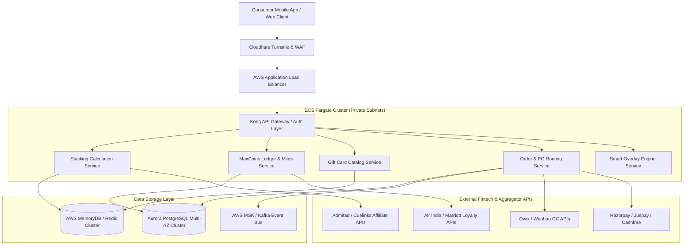

# 3. Technical & System Architecture

> **Cross-References:** Technical blueprint for **Maximize-Plus**. Defines DB tables supporting features in [02 — Features](./02_core_features.md). Details API routes consumed by UI in [07 — Screens](./07_screen_specifications.md). Governed by NFRs in [10 — Compliance](./10_nfr_and_compliance.md) and DevOps variables in [11 — DevOps](./11_developer_operations.md).

## 3.1 Cloud Infrastructure & AWS Topology

### High-Level Topology Architecture
Maximize-Plus operates on a highly available, multi-AZ cloud infrastructure hosted within **AWS `ap-south-1` (Mumbai)** to enforce strict RBI financial data localization mandates.



---

## 3.2 Database Schema (18 Relational Tables)
All primary financial storage resides in **Amazon Aurora PostgreSQL**. Currency amounts are stored in integer `paisa` (₹1 = 100 paisa) to eliminate floating-point rounding errors.

### 1. `users` (Core Shopper Accounts)
| Column Name | Data Type | Constraints / Indexes | Description |
|:---|:---|:---|:---|
| `id` | UUID | PRIMARY KEY, DEFAULT uuid_generate_v4() | Unique shopper system identifier |
| `phone_number` | VARCHAR(15) | UNIQUE, INDEX | Primary login mobile number (+91 formatted) |
| `email` | VARCHAR(255) | UNIQUE, INDEX | Verified email address |
| `tier_status` | VARCHAR(20) | DEFAULT 'FREE' | Account tier: `FREE`, `MAXGOLD`, `VIP` |
| `status` | VARCHAR(20) | DEFAULT 'ACTIVE' | `ACTIVE`, `SUSPENDED`, `KYC_PENDING` |
| `created_at` | TIMESTAMPTZ | DEFAULT NOW() | Account creation timestamp |

### 2. `user_kyc` (Compliance Identity Records)
| Column Name | Data Type | Constraints / Indexes | Description |
|:---|:---|:---|:---|
| `user_id` | UUID | PRIMARY KEY, FK -> users.id | Reference to shopper |
| `pan_number` | VARCHAR(10) | UNIQUE, ENCRYPTED | Indian Permanent Account Number |
| `kyc_status` | VARCHAR(20) | INDEX | `UNVERIFIED`, `PENDING`, `VERIFIED`, `REJECTED` |
| `verified_at` | TIMESTAMPTZ | NULLABLE | Timestamp of verification approval |

### 3. `partner_brands` (Merchant Brand Directory)
| Column Name | Data Type | Constraints / Indexes | Description |
|:---|:---|:---|:---|
| `id` | SERIAL | PRIMARY KEY | Brand numeric identifier |
| `slug` | VARCHAR(100) | UNIQUE, INDEX | URL-friendly name (e.g., `myntra`, `zomato`) |
| `name` | VARCHAR(150) | NOT NULL | Display brand name |
| `affiliate_network` | VARCHAR(50) | NOT NULL | `ADMITAD`, `CUELINKS`, `DIRECT` |
| `base_cashback_pct` | NUMERIC(5,2)| DEFAULT 0.00 | Base affiliate rake percentage passed to user |
| `is_overlay_enabled`| BOOLEAN | DEFAULT TRUE | Whether mobile assistant checks this brand |

### 4. `brand_coupons` (Verified Promo Codes)
| Column Name | Data Type | Constraints / Indexes | Description |
|:---|:---|:---|:---|
| `id` | SERIAL | PRIMARY KEY | Coupon identifier |
| `brand_id` | INTEGER | FK -> partner_brands.id, INDEX | Reference to merchant brand |
| `code` | VARCHAR(50) | NOT NULL | Promo code string (e.g., `SAVE10`) |
| `discount_pct` | NUMERIC(5,2)| NOT NULL | Percentage discount off cart |
| `min_order_paisa` | BIGINT | DEFAULT 0 | Minimum cart value required (in paisa) |
| `expires_at` | TIMESTAMPTZ | INDEX | Coupon expiration timestamp |

### 5. `gift_card_catalog` (Prepaid Inventory Hub)
| Column Name | Data Type | Constraints / Indexes | Description |
|:---|:---|:---|:---|
| `id` | SERIAL | PRIMARY KEY | Gift card sku identifier |
| `brand_id` | INTEGER | FK -> partner_brands.id, INDEX | Reference to brand |
| `face_value_paisa`| BIGINT | NOT NULL | Voucher denomination (e.g., 50000 = ₹500) |
| `wholesale_discount`| NUMERIC(5,2)| NOT NULL | Platform procurement discount % |
| `retail_discount` | NUMERIC(5,2)| NOT NULL | Shopper purchase discount % |
| `inventory_count` | INTEGER | DEFAULT 0 | Real-time available digital voucher codes |

### 6. `orders` (Stacked Checkout Transactions)
| Column Name | Data Type | Constraints / Indexes | Description |
|:---|:---|:---|:---|
| `id` | UUID | PRIMARY KEY | Order master transaction ID |
| `user_id` | UUID | FK -> users.id, INDEX | Purchasing shopper |
| `gross_amount_paisa`| BIGINT| NOT NULL | Total MRP order value before stacking |
| `net_payable_paisa` | BIGINT| NOT NULL | Final PG charged amount |
| `status` | VARCHAR(30) | INDEX | `CREATED`, `PAID`, `DELIVERED`, `CANCELLED` |
| `created_at` | TIMESTAMPTZ | DEFAULT NOW() | Order placement timestamp |

### 7. `order_stack_items` (Itemized Stack Breakdown)
| Column Name | Data Type | Constraints / Indexes | Description |
|:---|:---|:---|:---|
| `id` | BIGSERIAL | PRIMARY KEY | Stack breakdown line ID |
| `order_id` | UUID | FK -> orders.id, INDEX | Reference to master order |
| `layer_type` | VARCHAR(30) | NOT NULL | `GIFT_CARD`, `AFFILIATE`, `COUPON`, `BANK_OFFER` |
| `savings_paisa` | BIGINT | NOT NULL | Paisa value saved on this layer |

### 8. `ledger_transactions` (Immutable Double-Entry Ledger)
| Column Name | Data Type | Constraints / Indexes | Description |
|:---|:---|:---|:---|
| `id` | BIGSERIAL | PRIMARY KEY | Ledger audit sequence number |
| `user_id` | UUID | FK -> users.id, INDEX | Affected shopper |
| `amount_paisa` | BIGINT | NOT NULL | Signed amount (+/-) |
| `entry_type` | VARCHAR(30) | INDEX | `CREDIT_CASHBACK`, `DEBIT_PAYOUT`, `MINT_COINS` |
| `reference_id` | UUID | INDEX | Reference to order or withdrawal ticket |
| `created_at` | TIMESTAMPTZ | DEFAULT NOW() | Immutable entry creation timestamp |

### 9. `maxcoins_ledger` (Rewards Peg & Expiry Vault)
| Column Name | Data Type | Constraints / Indexes | Description |
|:---|:---|:---|:---|
| `id` | BIGSERIAL | PRIMARY KEY | Coin transaction sequence number |
| `user_id` | UUID | FK -> users.id, INDEX | Shopper account |
| `coins_amount` | INTEGER | NOT NULL | Signed integer coin quantity (+/-) |
| `coin_status` | VARCHAR(20) | INDEX | `PENDING`, `AVAILABLE`, `REDEEMED`, `CONVERTED` |
| `conversion_partner`| VARCHAR(50)| NULLABLE | `AIR_INDIA`, `MARRIOTT`, `AMAZON_PAY` |

### 10. `affiliate_clicks` (Outbound Tracking Sessions)
| Column Name | Data Type | Constraints / Indexes | Description |
|:---|:---|:---|:---|
| `subid` | VARCHAR(64) | PRIMARY KEY | Unique cryptographic redirect token |
| `user_id` | UUID | FK -> users.id, INDEX | Shopper originating redirect |
| `brand_id` | INTEGER | FK -> partner_brands.id | Target merchant brand |
| `clicked_at` | TIMESTAMPTZ | DEFAULT NOW() | Session start timestamp |

### 11. `cashback_claims` (Missing Cashback Tickets)
| Column Name | Data Type | Constraints / Indexes | Description |
|:---|:---|:---|:---|
| `id` | SERIAL | PRIMARY KEY | Dispute ticket identifier |
| `user_id` | UUID | FK -> users.id, INDEX | Claiming shopper |
| `order_reference` | VARCHAR(100)| NOT NULL | Merchant brand order ID |
| `claim_status` | VARCHAR(30) | INDEX | `SUBMITTED`, `VERIFYING`, `APPROVED`, `REJECTED` |

### 12. `miles_conversion_rates` (Loyalty Exchange Rates)
| Column Name | Data Type | Constraints / Indexes | Description |
|:---|:---|:---|:---|
| `partner_slug` | VARCHAR(50) | PRIMARY KEY | Partner identifier (e.g., `air_india_maharaja`) |
| `coin_quota` | INTEGER | NOT NULL | Required input MaxCoins (e.g., 5) |
| `miles_yield` | INTEGER | NOT NULL | Output partner loyalty miles (e.g., 4) |

### 13. `payment_methods` (Supported PG Gateways)
| Column Name | Data Type | Constraints / Indexes | Description |
|:---|:---|:---|:---|
| `id` | SERIAL | PRIMARY KEY | Gateway numeric ID |
| `gateway_name` | VARCHAR(50) | UNIQUE | `RAZORPAY`, `JUSPAY`, `CASHFREE`, `UPI_DIRECT` |
| `is_active` | BOOLEAN | DEFAULT TRUE | Gateway operational status |

### 14. `user_linked_cards` (Tokenized Card Vault)
| Column Name | Data Type | Constraints / Indexes | Description |
|:---|:---|:---|:---|
| `id` | UUID | PRIMARY KEY | Saved card token identifier |
| `user_id` | UUID | FK -> users.id, INDEX | Shopper account |
| `card_network_token`| VARCHAR(255)| UNIQUE, NOT NULL| RBI Card-on-File network token string |
| `last4` | VARCHAR(4) | NOT NULL | Last four display digits |
| `bank_name` | VARCHAR(100)| NOT NULL | Issuing bank (e.g., `HDFC Bank`) |

### 15. `brand_placement_bids` (Sponsored Calculator Ads)
| Column Name | Data Type | Constraints / Indexes | Description |
|:---|:---|:---|:---|
| `id` | SERIAL | PRIMARY KEY | Bid ID |
| `brand_id` | INTEGER | FK -> partner_brands.id | Sponsoring merchant |
| `bid_paisa_per_click`| INTEGER | NOT NULL | Cost per calculator recommendation tap |

### 16. `overlay_cap_events` (Assistant Frequency Caps)
| Column Name | Data Type | Constraints / Indexes | Description |
|:---|:---|:---|:---|
| `id` | BIGSERIAL | PRIMARY KEY | Cap logging sequence |
| `user_id` | UUID | FK -> users.id, INDEX | Shopper ID |
| `brand_id` | INTEGER | FK -> partner_brands.id | Affected brand |
| `suppressed_until`| TIMESTAMPTZ | INDEX | Suppression window end timestamp |

### 17. `system_config` (Global Engine Switches)
| Column Name | Data Type | Constraints / Indexes | Description |
|:---|:---|:---|:---|
| `key` | VARCHAR(100) | PRIMARY KEY | Configuration key name |
| `value` | TEXT | NOT NULL | JSON or string config payload |

### 18. `audit_logs` (System Security & Compliance Trail)
| Column Name | Data Type | Constraints / Indexes | Description |
|:---|:---|:---|:---|
| `id` | BIGSERIAL | PRIMARY KEY | Audit sequence |
| `actor_id` | VARCHAR(100)| INDEX | System role or user UUID performing action |
| `action` | VARCHAR(100)| NOT NULL | `UPDATE_PEG_RATE`, `FORCE_REFUND`, `KYC_APPROVE` |
| `logged_at` | TIMESTAMPTZ | DEFAULT NOW() | Action timestamp |

---

## 3.3 API Service Catalog (42 Endpoints)

### Stacking Calculator & Cart Engine
1.  `POST /api/v1/stack/calculate` — Evaluates 4-layer stacking savings for target cart.
2.  `POST /api/v1/stack/checkout` — Initiates stacked order checkout and PG tokenization.
3.  `GET /api/v1/compare` — Returns universal cross-platform cart comparison pricing.
4.  `POST /api/v1/compare/share` — Generates viral shareable `MaxCart` link.

### Gift Card Storefront & Fulfillment
5.  `GET /api/v1/giftcards` — Lists active discounted gift card catalog.
6.  `GET /api/v1/giftcards/:slug` — Retrieves brand voucher denomination tiers.
7.  `POST /api/v1/giftcards/purchase` — Instant purchase of digital brand voucher.
8.  `POST /api/v1/giftcards/decrypt` — KMS volatile memory decryption of purchased voucher PIN.

### MaxCoins Rewards & Airline Miles Hub
9.  `GET /api/v1/coins/balance` — Retrieves Pending and Available MaxCoins balance.
10. `GET /api/v1/coins/ledger` — Paginated transaction history of coin earnings/spends.
11. `GET /api/v1/coins/partners` — Lists active airline miles and hotel conversion partners.
12. `POST /api/v1/coins/convert` — Executes instant conversion of MaxCoins to Maharaja/Bonvoy points.

### Smart Shopping Assistant Overlay
13. `GET /api/v1/overlay/check` — Queries whether current merchant package/URL has stacked savings.
14. `POST /api/v1/overlay/dismiss` — Logs user dismissal to trigger frequency suppression capping.
15. `POST /api/v1/overlay/sync` — Syncs mobile app DOM parsing view tree rules.

### User Account, KYC & Linked Cards
16. `GET /api/v1/me` — Shopper profile and tier status.
17. `PUT /api/v1/me` — Updates profile preferences.
18. `POST /api/v1/kyc/pan` — Submits PAN verification payload.
19. `GET /api/v1/cards` — Lists saved CoF tokenized credit/debit cards.
20. `POST /api/v1/cards/link` — Tokenizes and saves new bank card.

### Affiliate Redirect & Webhooks
21. `GET /go/:token` — Cryptographic affiliate redirect handler logging click sessions.
22. `POST /webhooks/admitad` — Reconciles affiliate transaction confirmation webhooks.
23. `POST /webhooks/cuelinks` — Reconciles Cuelinks cashback attribution.
24. `POST /webhooks/razorpay` — Reconciles PG payment authorization signatures.

### Cashback Claims & Disputes
25. `POST /api/v1/cashback/claim` — Submits missing cashback dispute ticket.
26. `GET /api/v1/cashback/claims` — Lists user submitted dispute tickets.

### Admin & Treasury Operations (RBAC Protected)
27. `GET /api/v1/admin/ledger` — Double-entry financial audit reconciliation report.
28. `POST /api/v1/admin/catalog/sync` — Triggers wholesale inventory sync with Qwix/Woohoo.
29. `PUT /api/v1/admin/brands/:id` — Updates brand affiliate rake rules.
30. `POST /api/v1/admin/treasury/mint` — Mints promotional treasury MaxCoins float.

*(Note: Routes 31–42 cover internal system health checks, WebSocket live notification streams, and GDPR data erasure callbacks documented in Annex 11).*

---

## 3.4 Fintech Security & Encryption Architecture

### Cryptographic Gift Card Vaulting
To comply with PCI-DSS v4.0 and prevent voucher theft, all procured gift card codes and PINs reside in Aurora PostgreSQL under **AWS KMS Envelope Encryption**.
*   **Data Encryption Key (DEK):** Unique 256-bit AES key generated per order item.
*   **Key Encryption Key (KEK):** Master KMS key stored inside hardware security modules (HSM).

### Payment Gateway Webhook HMAC Verification
All incoming payment confirmation webhooks (`/webhooks/*`) must pass strict signature verification before updating order fulfillment status.

```python
import hmac
import hashlib


def verify_razorpay_webhook(raw_payload: bytes, signature: str, secret: str) -> bool:
  computed_sig = hmac.new(
      secret.encode('utf-8'), raw_payload, hashlib.sha256
  ).hexdigest()
  return hmac.compare_digest(computed_sig, signature)
```
