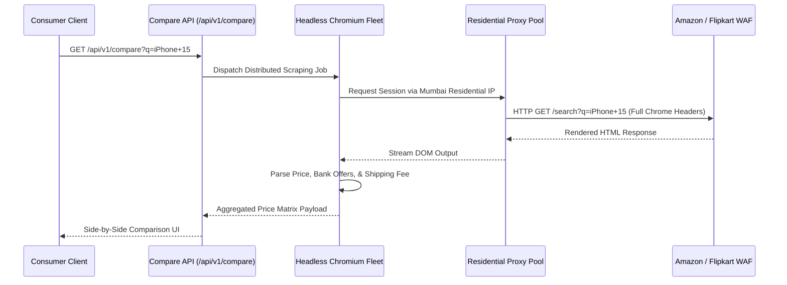

# 6. AI Engines & External API Integrations

> **Cross-References:** Technical specs for third-party connectors consumed by **Maximize-Plus**. Powers mechanics in [02 — Features](./02_core_features.md). Handled by microservices in [03 — Architecture](./03_technical_architecture.md). Triggers events in [09 — Notifications](./09_notifications_and_emails.md).

## 6.1 Affiliate Aggregator API Specifications

### Admitad / Cuelinks Outbound Redirect & Webhook Reconciliation
When a user clicks "Execute Stack" on an Admitad-supported merchant (e.g., Myntra), the platform constructs a cryptographic tracking URI.

#### Outbound URL Structure
`https://ad.admitad.com/g/myntra_offer/?subid=9bf98657-6a67-4e94-1b6c-e7050woff2`

#### Incoming Admitad Webhook Payload (`POST /webhooks/admitad`)
```json
{
  "event_id": "wh_adm_88123941",
  "subid": "9bf98657-6a67-4e94-1b6c-e7050woff2",
  "action_type": "sale",
  "order_id": "ORD-MYN-559123",
  "order_amount_inr": 5000.00,
  "commission_amount_inr": 400.00,
  "status": "pending",
  "currency": "INR",
  "timestamp": "2026-06-26T13:30:15Z"
}
```

---

## 6.2 AI Smart Stacking Advisor Engine

### Feature Architecture
Maximize-Plus embeds an LLM-powered (Gemini Flash 1.5) financial optimization advisor on the Universal Cart screen. The model evaluates complex multi-brand shopping lists to suggest alternative stacked purchasing paths.

### System Prompt Template (Cart Optimization Advisor)
```markdown
You are the Maximize-Plus AI Financial Deal Advisor. Your sole objective is to analyze a user's shopping cart list across Indian e-commerce merchants and suggest exact deal-stacking substitutions that maximize total rupee savings.

### Input Parameters:
- Cart Items: {USER_CART_ITEMS_JSON}
- User Linked Credit Cards: {USER_SAVED_CARDS_LIST}
- Active Gift Card Discounts: {ACTIVE_GC_CATALOG_JSON}
- Available MaxCoins Balance: {USER_COIN_BALANCE}

### Rules:
1. Never suggest purchasing a gift card whose denomination exceeds the cart item value by more than 20%.
2. Prioritize credit card bank discounts over general affiliate cashbacks if mutually exclusive.
3. Always factor in 1 MaxCoin = ₹1 INR hard redemption value.

### Output Structure:
Provide a strictly valid JSON response adhering to `AIRecommendationResponseSchema` containing recommended gift card purchases, coupon codes, and an itemized savings summary.
```

---

## 6.3 Universal Scraper Comparison Cart Pipeline

### Distributed Crawling & Stealth Architecture
To prevent Cloudflare Turnstile blocks (`403 Forbidden`) when aggregating pricing across Amazon, Flipkart, and Reliance Digital, the Scraper Engine utilizes headless Chromium fleets routed through residential proxy rotators (Webshare / IPRoyal).



---

## 6.4 Airline Miles Partner Loyalty Integration Hub

### Air India Maharaja Club OAuth2 Conversion Flow
When a user redeems MaxCoins for flight upgrades (`POST /api/v1/coins/convert`), the platform executes an OAuth2 token exchange with Air India's loyalty API.

#### Outbound Conversion Request Payload
```json
{
  "request_id": "cnv_ai_9918231",
  "member_id": "AI-982341",
  "member_last_name": "SHARMA",
  "points_to_credit": 4000,
  "source_currency": "MAXCOINS",
  "debited_coins": 5000,
  "promo_campaign": "MAHARAJA_5_4_BONUS",
  "timestamp": "2026-06-26T13:35:00Z"
}
```

#### Air India API Response Payload
```json
{
  "status": "SUCCESS",
  "partner_reference": "AI_LOYALTY_TX_88192",
  "credited_points": 4000,
  "updated_member_tier": "GOLD",
  "processed_at": "2026-06-26T13:35:03Z"
}
```

---

## 6.5 AI & API Operational Cost Model

| Engine / Connector Service | Pricing Basis | Estimated Monthly Quota | Unit Cost | Total Monthly Cost (₹ INR & USD) |
|:---|:---|:---|:---|:---|
| **Gemini Flash 1.5 LLM Advisor**| Token Burn (Input/Output) | 50M Input / 10M Output | ₹29.22 ($0.35) / 1M Tokens | **₹1,753.50** ($21.00) |
| **Residential Stealth Proxies**| Bandwidth Consumption | 500 GB Datacenter/Residential| ₹334 ($4.00) / GB | **₹1,67,000.00** ($2,000.00) |
| **Qwix / Woohoo GC Issuance API**| Transaction Flat Fee | 40,000 Vouchers Issued | ₹1.50 per Voucher| **₹60,000.00** ($718.56) |
| **Twilio WhatsApp API Webhooks** | Transactional Message | 50,000 Delivery Alerts | ₹0.78 per Msg | **₹39,000.00** ($467.06) |
| **AWS KMS HSM Envelope Vault** | API Decryption Calls | 100,000 Decryption Ops | ₹2.50 ($0.03) / 10K Ops | **₹25.05** ($0.30) |
| **Total Blended API OpEx Cost**| — | — | — | **₹2,67,778.55 / mo (~$3,206.92 USD)** |
