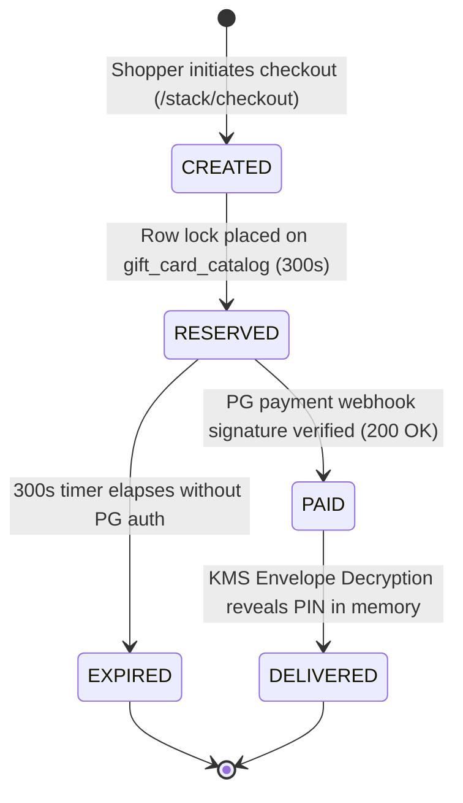
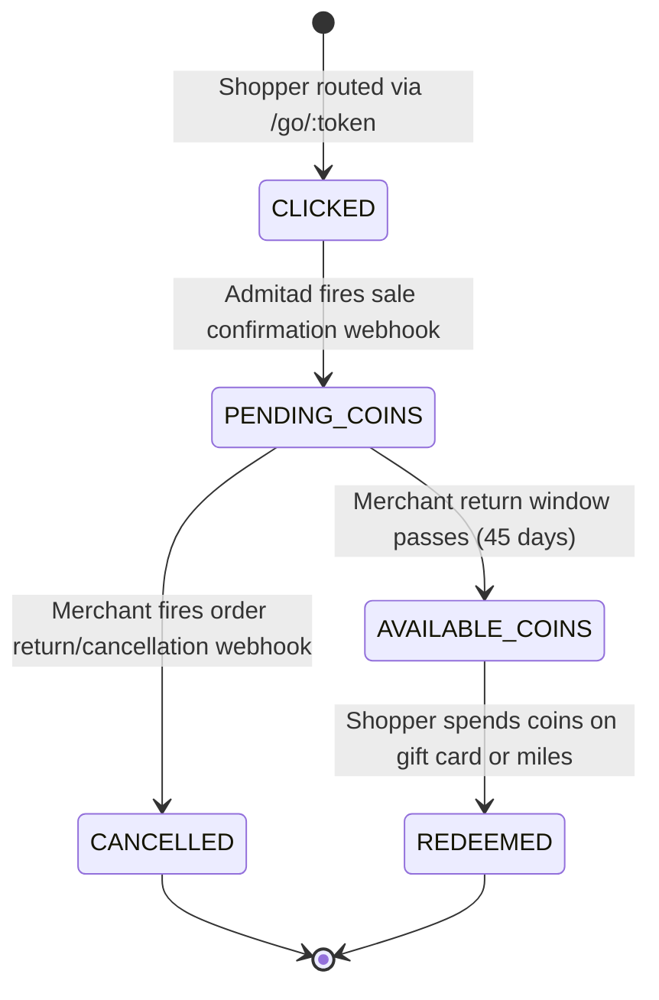
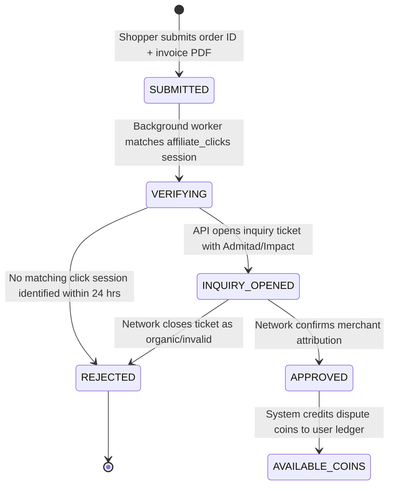

# 8. Business Logic, State Machines & RBAC Governance

> **Cross-References:** Governance and business rules for **Maximize-Plus**. Enforced across database triggers in [03 — Architecture](./03_technical_architecture.md). Validates user actions in [04 — Stories](./04_user_stories.md) and inputs on [07 — Screens](./07_screen_specifications.md). Governed by compliance guidelines in [10 — Compliance](./10_nfr_and_compliance.md).

## 8.1 Role-Based Access Control (RBAC) Permission Matrix

| Platform Feature / API Route | Consumer Shopper | VIP Shopper (Gold)| Brand Merchant | Support Agent | Treasury SuperAdmin |
|:---|:---:|:---:|:---:|:---:|:---:|
| **Calculate Deal Stack (`/stack/calculate`)**| ✅ | ✅ | ✅ | ✅ | ✅ |
| **Execute & Buy Gift Card (`/giftcards/buy`)**| ✅ | ✅ | ❌ | ❌ | ✅ |
| **Convert Coins to Miles (`/coins/convert`)** | ✅ Base Rate | ✅ Bonus Rate | ❌ | ❌ | ✅ |
| **Reveal Decrypted GC PIN (`/giftcards/pin`)**| ✅ Own Orders | ✅ Own Orders | ❌ | ❌ | ✅ Audit Override |
| **Submit Dispute Claim (`/cashback/claim`)**| ✅ | ✅ | ❌ | ❌ | ✅ |
| **Approve Missing Cashback (`/admin/claim`)** | ❌ | ❌ | ✅ Own Brand | ✅ (< ₹500) | ✅ Unlimited |
| **Update Brand Rake Rules (`/admin/brands`)** | ❌ | ❌ | ✅ Own Brand | ❌ | ✅ |
| **Execute Escrow Audit (`/admin/ledger`)** | ❌ | ❌ | ❌ | ❌ | ✅ |
| **Mint Treasury Float (`/admin/mint`)** | ❌ | ❌ | ❌ | ❌ | ✅ Strict Dual-Auth|

---

## 8.2 Core System State Machines (Mermaid Flowcharts)

### 1. Stacked Order & Gift Card Fulfillment State Machine

### 2. Affiliate Cashback Settlement State Machine

### 3. Missing Cashback Claim Dispute State Machine

---

## 8.3 Financial Validation & Accounting Rules

### BR-FIN-01: Absolute Ledger Immutability
The `ledger_transactions` and `maxcoins_ledger` tables enforce an append-only architecture. No system role—including PostgreSQL database superusers—is permitted to execute `UPDATE` or `DELETE` SQL commands on existing financial rows. Corrections must execute strictly via signed compensatory `INSERT` entries.

### BR-FIN-02: MaxCoins Hard 1:1 INR Pegging
1 MaxCoin mathematically equals 100 paisa (₹1.00 INR). During gift voucher checkout, coin redemption value cannot exceed 100% of the net order payable amount.

### BR-FIN-03: Minimum Miles Conversion Thresholds
Users cannot convert MaxCoins into airline frequent flyer points unless their Available Coin balance meets or exceeds the partner program's minimum quota (e.g., 500 Coins for Air India Maharaja Club).

---

## 8.4 Anti-Fraud & Velocity Checks

| Anti-Fraud Rule ID | Trigger Condition | System Enforcement Action |
|:---|:---|:---|
| **AF-VEL-01** | Shopper attempts $> 5$ gift card purchases within 60 minutes | Temporarily block card purchasing for 24 hours (`ERR_VELOCITY_EXCEEDED`); trigger OTP re-verification. |
| **AF-IP-02** | Stacking calculation requests originating from TOR or VPN exit nodes | Deny calculation request (`403 Forbidden`); require Cloudflare Turnstile interactive CAPTCHA challenge. |
| **AF-REF-03** | Shopper creates comparison cart share link and clicks own link from same device | Detect matching device fingerprint / IP address; suppress welcome bonus coin minting (`MINT_BLOCKED_SELF_REF`). |
| **AF-PIN-04** | 3 consecutive failed 4-digit security PIN entries during KMS reveal | Lock PIN reveal functionality for 6 hours; dispatch alert email with instant account freeze link. |

---

## 8.5 Data Retention & Archival Policy

### DPDP Act / GDPR Right to Erasure
When a shopper invokes `DELETE /api/v1/me`, the system executes an asynchronous cascading purge:
1.  **Immediate:** Anonymize PII columns (`name`, `email`, `phone_number`, `pan_number`) in `users` and `user_kyc` tables to randomized cryptographic hashes.
2.  **Financial Retention:** Retain anonymized transaction audit rows in `ledger_transactions` and `orders` for 8 years pursuant to Indian Income Tax Act compliance guidelines.
3.  **30-Day Purge:** Hard-delete volatile Redis sessions, mobile device push tokens, and S3 dispute invoice PDFs within 30 days.
