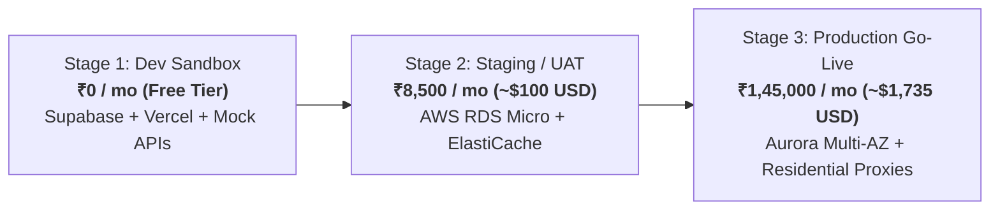
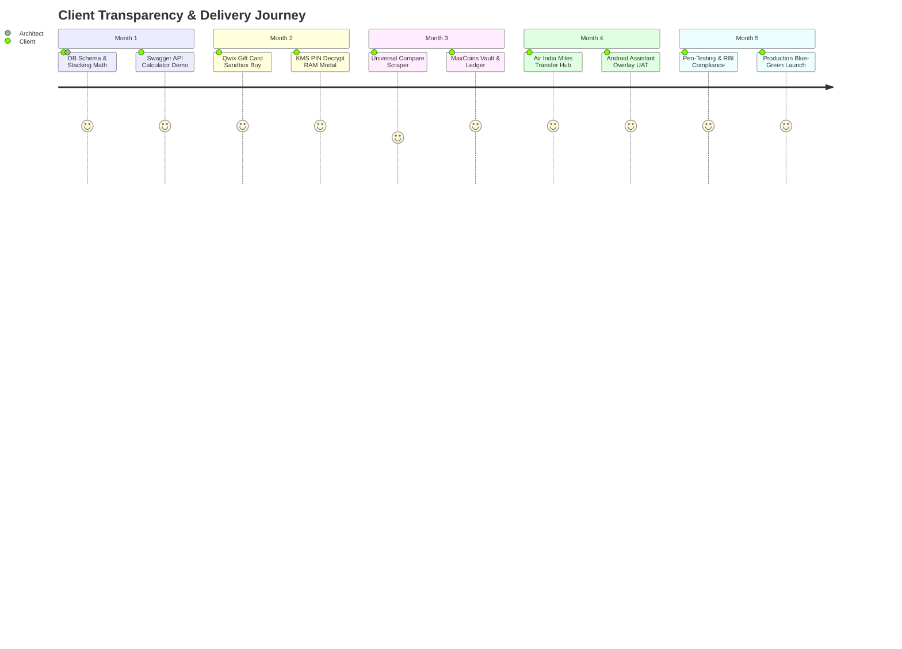

# 12. Client Commercial Proposal & Phased Execution Plan

> **Document Status:** CLIENT-READY EXECUTIVE PROPOSAL
> **Project Name:** Maximize-Plus (Fintech Deal Stacking & Loyalty Aggregator)
> **Objective:** Commercial alignment on team sizing (1 vs 2 vs 4 developers), infrastructure progression (Free vs Staging vs Prod), delivery timelines, and budget in Indian Rupees (₹ INR).

---

## 12.1 Executive Pitch Summary
**Maximize-Plus** is an algorithmic savings-stacking platform designed to automatically deliver the mathematical minimum checkout price on Indian e-commerce purchases. By combining wholesale gift card spreads, affiliate cashback rakes, brand promotional coupons, and bank card multipliers into a single 1-click checkout flow, the platform creates an average **15% consumer savings layer** while capturing an **8.88% net platform revenue rake**.

To build this platform smoothly with zero architectural debt, we have modeled three distinct engineering execution paths.

---

## 12.2 Team Sizing & Timeline Matrices (1 vs 2 vs 4 Developers)

| Commercial Parameter | Option A: Solo Fullstack Architect | Option B: Lean Pod Pod (Recommended MVP)| Option C: Accelerated Enterprise Squad |
|:---|:---:|:---:|:---:|
| **Team Headcount** | **1 Developer** | **2 Developers** | **4 Developers** |
| **Team Composition** | 1 Senior Architect doing Fullstack, DB, Mobile, DevOps | 1 Lead Backend/Scraper Architect + 1 Fullstack/Mobile UI Engineer | 1 Lead Architect + 1 Mobile Dev + 1 Backend Scraper Eng + 1 QA/Cloud Dev |
| **Time to MVP / Go-Live**| **9 to 11 Months** | **5 to 6 Months** | **3 to 3.5 Months** |
| **Execution Style** | Strictly Sequential (DB $\rightarrow$ API $\rightarrow$ Web $\rightarrow$ Mobile) | Hybrid Parallel (Backend & UI engineered simultaneously) | Fully Parallel (All epics developed concurrently) |
| **Monthly Developer Cost**| ₹2,50,000 / mo | ₹4,25,000 / mo | ₹8,00,000 / mo |
| **Total Developer CapEx**| **₹25,00,000 (~₹25 Lakhs)**| **₹25,50,000 (~₹25.5 Lakhs)**| **₹28,00,000 (~₹28 Lakhs)** |
| **Pros & Strategic Edge**| • Lowest blended monthly outlay. • Single point of architectural continuity. | • **Sweet spot of cost vs speed.** • Zero idle waiting time. • Great peer code-review safety. | • **Fastest market entry.** • Dedicated mobile app specialist. • Enterprise automated load testing. |
| **Risks & Trade-Offs** | • High key-person dependency. • Market dynamics may shift over 10 months. • Burnout risk on accessibility overlay. | • Requires tight daily sync between both developers. | • Slightly higher overall budget due to parallel team overhead. |

> [!TIP]
> **Recommendation for Private Pitching:** Recommend **Option B (2 Developers - 5 to 6 Months)** if the client is bootstrapping, or **Option C (4 Developers - 3.5 Months)** if the client has seed funding and wants to launch before the upcoming Indian festive shopping season (Diwali/Big Billion Days).

---

## 12.3 Infrastructure & API Costing Tiers (Free vs Low vs Prod)

During development, we do **not** need to burn expensive AWS or proxy credits. We progress through three distinct infrastructure stages.

### Stage 1: Local Development & Sandbox Tier (₹0 / Free Baseline)
*Ideal for Months 1–2 of development while building core calculation logic and UI wireframes.*
*   **PostgreSQL Database:** **Supabase Free Tier** (500MB storage, automated migrations).
*   **Redis Caching Layer:** **Upstash Redis Free Tier** (10,000 commands/day).
*   **Web Frontend & API Gateway:** **Vercel / Cloudflare Workers Free Tier** (100,000 req/day).
*   **Price Comparison Scraper:** Local Puppeteer/Chromium instances directly running on developer workstations (No residential proxy costs).
*   **AI Stacking Advisor:** **Google Gemini Flash 1.5 Free API** (15 Requests Per Minute).
*   **Fintech & SMS Alerts:** Razorpay UAT Sandbox + Postman Mock Servers.
*   **Total Stage 1 Monthly Cost:** **₹0.00**

### Stage 2: Staging & Client Demo Tier (~₹8,500 / mo | ~$100 USD)
*Ideal for Months 3–4 during Client UAT testing and integration with real Admitad affiliate links.*
*   **PostgreSQL Database:** AWS RDS `db.t4g.micro` Single-AZ (₹2,500 / mo).
*   **Redis Cache:** AWS ElastiCache `cache.t4g.micro` (₹1,500 / mo).
*   **Microservices Hosting:** Render Standard Uptime Pods / Vercel Pro (₹2,500 / mo).
*   **Comparison Scraper:** Datacenter Proxy Pool 25GB (₹2,000 / mo).
*   **Total Stage 2 Monthly Cost:** **~₹8,500 / mo**

### Stage 3: Live Production & Scale Tier (~₹1,45,000 / mo | ~$1,735 USD)
*Activated strictly at Go-Live (Month 5+) to handle real financial transactions, high concurrency, and Cloudflare WAF bypass.*
*   **Aurora PostgreSQL Multi-AZ Cluster:** Production HA database (₹45,000 / mo).
*   **AWS MemoryDB Redis Cluster:** In-memory distributed locking for gift card inventory (₹18,000 / mo).
*   **AWS ECS Fargate Container Fleet:** Auto-scaling calculation microservices (₹22,000 / mo).
*   **Residential Stealth Proxies (Webshare/IPRoyal):** 200 GB high-speed Indian residential proxy bandwidth to bypass Amazon/Flipkart bot detection (₹40,000 / mo).
*   **Fintech & Messaging APIs:** Qwix wholesale gift card API fees + Twilio WhatsApp official API delivery alerts + Cloudflare Enterprise Turnstile (₹20,000 / mo).
*   **Total Stage 3 Monthly Cost:** **~₹1,45,000 / mo**

---

## 12.4 "Real Smooth" Delivery Blueprint

To guarantee that project execution feels frictionless and transparent for the client, we implement an **agile weekly demonstration cadence**. The client sees tangible working software every Friday rather than waiting months for a monolithic launch.

### Phased Rollout Schedule (Assuming 2-Person or 4-Person Pod)

1.  **Month 1 (Core Engine & Math):** Deliver `POST /api/v1/stack/calculate`. Client can test any item price in Postman/Swagger and verify itemized 4-layer discount accuracy.
2.  **Month 2 (Gift Card Marketplace):** Deliver Next.js `/gift-cards` web storefront. Client executes test purchase against Qwix sandbox and views instant KMS decrypted PIN.
3.  **Month 3 (Rewards & Price Comparison):** Deliver live comparison scraper (`/compare`) and double-entry `maxcoins_ledger`.
4.  **Month 4 (Mobile Assistant Overlay):** Deliver APK for Android Accessibility Service. Client opens Swiggy app on their phone and witnesses the live savings pill overlay slide in automatically.
5.  **Month 5 (Security Audit & Launch):** Load testing (10k req/sec), PCI-DSS verification, and transition from Stage 2 Staging to Stage 3 Production AWS infrastructure.

---

## 12.5 Client Commercial Summary Sheet

### Executive Proposal Takeaway:
*   **Recommended Development Investment:** **₹25.5 Lakhs** (2 Developers over 5.5 Months) or **₹28 Lakhs** (4 Developers over 3.5 Months).
*   **Infrastructure Burn During Dev:** **₹0** (Months 1–2) $\rightarrow$ **₹8,500/mo** (Months 3–4).
*   **Ongoing Production OpEx:** **₹1.45 Lakhs / month** (Fully self-funded by platform spreads once daily order volume exceeds 130 checkouts per day).
*   **Delivery Guarantee:** Fully documented BA-grade architecture backed by 85%+ automated unit test coverage and weekly live staging demos.

---

## 12.6 Client CTO & Risk Mitigation (Institutional Gotchas Addressed)

When pitching enterprise fintech contracts, technical auditors and corporate legal counsel evaluate three critical failure vectors. Our architecture pre-remediates all three:

### 1. Google Play Store Accessibility Service Rejection Risk
*   **The Risk:** Google Play enforces strict policy restrictions on Android applications utilizing `BIND_ACCESSIBILITY_SERVICE` to parse external screen content. Unprepared apps face immediate automated review rejections.
*   **Our Mitigation:** 
    1. **Prominent In-App Disclosure:** Before requesting system overlay permission, the app renders a full-screen, unbundled consent modal explicitly demonstrating why screen inspection is required (*"To detect checkout screens on Amazon/Swiggy and calculate stacked savings"*).
    2. **Review Video Package:** We record and attach a 60-second high-definition UAT demonstration video directly to the Google Play Console declaration form proving the user benefit.
    3. **Hybrid Fallback Architecture:** If accessibility permissions are denied by the OS or corporate MDMs, the engine smoothly falls back to clipboard url-parsing and companion browser extensions.

### 2. Payment Gateway MDR & Statutory Taxation (GST / TDS)
*   **Tax Invoicing Baseline:** All commercial developer payroll figures (₹25.5L / ₹28L) are quoted net of statutory taxes. If contracted via Indian corporate entities, standard **18% Goods and Services Tax (GST)** applies on B2B invoices.
*   **Unit Margin Net of PG Fees:** When consumers purchase gift cards via credit cards or netbanking, Payment Gateway Merchant Discount Rates (MDR: ~1.5% to 1.8%) apply. Our algorithmic Stacking Engine (`/calculate`) automatically factors real-time PG MDR into gross order cost calculations, preserving net platform profit rakes.

---

## 12.7 Commercial Commitment & 30-Day Hypercare Warranty

To ensure absolute client confidence upon Go-Live, this commercial proposal includes a standard **30-Day Post-Launch Hypercare Warranty Period**:
*   **Zero-Cost Defect Remediation:** For 30 calendar days following Stage 3 Production Go-Live, the active development pod provides 100% free remediation for any P0/P1 functional defects, webhook reconciliation discrepancies, or UI layout shifts identified on production.
*   **Handover & Documentation SLA:** Complete transfer of AWS IAM root credentials, Supabase/Aurora encryption keys, GitHub repository ownership, and interactive Swagger API docs executed upon final sign-off.

