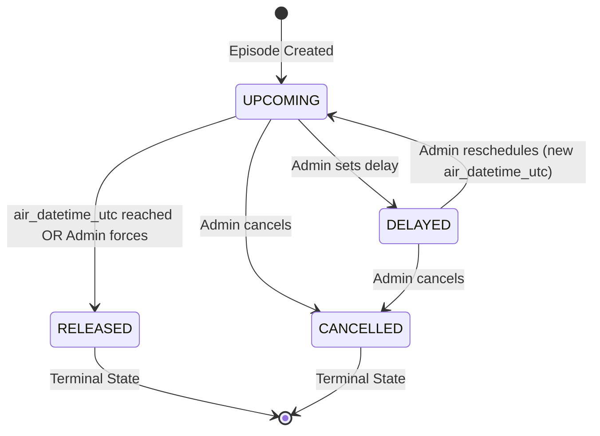

# 8. Business Rules & Role-Based Access Control (RBAC)

> **Cross-References:** State machine colors → [07 — Screens](./07_screen_specifications.md#711-color-palette-dark-mode--default) · Data validation → [03 — Architecture](./03_technical_architecture.md#33-data-models-supabase-postgresql) · Feature tiers → [04 — Monetization](./04_monetization_and_metrics.md#413-stream-c-anipulse-pro-subscription).

This document defines every business rule, access control policy, and data governance constraint. These rules are the system's source of truth. If any document conflicts with these rules, this document takes precedence.

---

## 8.1 Role-Based Access Control (RBAC) Matrix

### 8.1.1 Role Definitions
| Role | Who | Created How | Count |
|:---|:---|:---|:---|
| **SuperAdmin** | Project owner(s) | Manual Supabase seed | 1-2 |
| **Content Editor** | Trusted team members | Invited by SuperAdmin via email magic link | 1-5 |
| **App User (Free)** | End-user, no subscription | Downloads app. Optional Supabase Auth signup. | Unlimited |
| **App User (PRO)** | End-user, paying subscriber | Purchases PRO via Apple/Google in-app purchase | Unlimited |

### 8.1.2 Permission Matrix

| Permission | SuperAdmin | Content Editor | Free User | PRO User |
|:---|:---|:---|:---|:---|
| Login to Admin Dashboard | ✅ Full | ✅ Limited | ❌ | ❌ |
| View Staging Queue | ✅ | ✅ | ❌ | ❌ |
| Approve/Reject Staged Data | ✅ | ❌ | ❌ | ❌ |
| Create/Edit Anime Records | ✅ | ✅ | ❌ | ❌ |
| Delete Anime Records | ✅ | ❌ | ❌ | ❌ |
| Create/Edit News Articles | ✅ | ✅ | ❌ | ❌ |
| Delete News Articles | ✅ | ❌ | ❌ | ❌ |
| Manage Schedule (Episodes) | ✅ | ✅ | ❌ | ❌ |
| Force R2 Sync | ✅ | ❌ | ❌ | ❌ |
| View System Logs | ✅ | ❌ | ❌ | ❌ |
| Invite New Editors | ✅ | ❌ | ❌ | ❌ |
| Manage Sponsored Cards | ✅ | ❌ | ❌ | ❌ |
| Browse Schedule (App) | ✅ | ✅ | ✅ | ✅ |
| Browse News Feed (App) | ✅ | ✅ | ✅ | ✅ |
| Add to Local Watchlist | ✅ | ✅ | ✅ | ✅ |
| Sync Watchlist to Cloud | ✅ | ✅ | ✅ (50 show limit) | ✅ (Unlimited) |
| Receive Push Notifications | ✅ | ✅ | ✅ | ✅ (Priority) |
| View Ads | ❌ | ❌ | ✅ | ❌ |
| Custom Themes | ✅ | ✅ | ❌ | ✅ |
| Delete Own Account (GDPR) | — | — | ✅ | ✅ |

### 8.1.3 Implementation: Supabase Row-Level Security (RLS)
Access control is enforced at the database level using RLS policies, not just in the frontend UI.

```sql
-- Example RLS policy: Only admins and editors can INSERT into anime_series
CREATE POLICY "admin_editor_insert_anime"
ON anime_series FOR INSERT
TO authenticated
WITH CHECK (
  (SELECT role FROM profiles WHERE id = auth.uid()) IN ('admin', 'editor')
);

-- Example RLS policy: Anyone can SELECT from anime_series (used by Cloudflare Worker)
CREATE POLICY "public_read_anime"
ON anime_series FOR SELECT
TO anon, authenticated
USING (true);

-- Example RLS policy: Users can only modify their own watchlist
CREATE POLICY "own_watchlist_only"
ON user_watchlists FOR ALL
TO authenticated
USING (user_id = auth.uid())
WITH CHECK (user_id = auth.uid());
```

---

## 8.2 The "Episode Status" State Machine

An episode must transition through strict states. Invalid transitions are blocked at the database level.

### 8.2.1 State Diagram


### 8.2.2 State Definitions

| Status | Trigger | DB Rule | App UI | Color Token |
|:---|:---|:---|:---|:---|
| **`UPCOMING`** | Default on creation | `air_datetime_utc > now()` | Countdown timer ticking live | `--accent-primary` (`#00E5FF`) |
| **`RELEASED`** | Timer reaches 0 OR admin manual override | `air_datetime_utc <= now()` | "Aired ✓" label + "Watch Now" button activates | `--accent-success` (`#00C853`) |
| **`DELAYED`** | Admin sets status via dropdown | `status = 'delayed'` | Red "DELAYED" tag + optional reason text | `--accent-danger` (`#FF1744`) |
| **`CANCELLED`** | Admin sets status via dropdown | `status = 'cancelled'` | Card opacity `0.4`, greyed out, moved to list bottom | `--accent-cancelled` (`#9E9E9E`) |

### 8.2.3 Invalid Transitions (Blocked)
*   `RELEASED` → `UPCOMING` (cannot un-release an episode)
*   `CANCELLED` → `UPCOMING` (must create a new episode if reinstated)
*   `CANCELLED` → `RELEASED` (a cancelled episode cannot air)

### 8.2.4 Database Constraint
```sql
-- Trigger function to enforce valid state transitions
CREATE OR REPLACE FUNCTION enforce_episode_state_transition()
RETURNS TRIGGER AS $$
BEGIN
    IF OLD.status = 'released' AND NEW.status IN ('upcoming', 'delayed') THEN
        RAISE EXCEPTION 'Cannot transition from RELEASED to %', NEW.status;
    END IF;
    IF OLD.status = 'cancelled' AND NEW.status != 'cancelled' THEN
        RAISE EXCEPTION 'Cannot transition from CANCELLED to %', NEW.status;
    END IF;
    RETURN NEW;
END;
$$ LANGUAGE plpgsql;

CREATE TRIGGER check_episode_state
BEFORE UPDATE ON broadcast_schedule
FOR EACH ROW EXECUTE FUNCTION enforce_episode_state_transition();
```

---

## 8.3 Data Validation Rules

These rules are enforced at the database level (Supabase constraints and triggers) to guarantee the JSON never breaks the Flutter app.

| Rule ID | Rule Name | Scope | Enforcement | Description |
|:---|:---|:---|:---|:---|
| BR-01 | **Null Safety** | `anime_series` | `NOT NULL` constraint on `title_en`, `cover_image_url`, `studio` | These fields must never be empty. The Flutter parser assumes they exist. |
| BR-02 | **UTC Enforcement** | `broadcast_schedule` | Admin UI converts local time → UTC before saving | All `air_datetime_utc` values are stored as UTC. The Flutter app performs client-side timezone conversion. |
| BR-03 | **JSON Schema Validation** | Cloudflare Worker | Worker validates output against JSON schema before R2 upload | If validation fails: abort upload, keep old JSON, alert SuperAdmin via Discord webhook. |
| BR-04 | **headline Length** | `news_articles` | `CHECK (char_length(headline) <= 200)` | Headlines must be 200 chars or less for proper card rendering. |
| BR-05 | **summary Length** | `news_articles` | `CHECK (char_length(body_summary) <= 500)` | Summaries must be 500 chars or less. |
| BR-06 | **Image Format** | R2 Upload | Browser-side conversion | Only `.webp` images are uploaded. PNGs and JPGs are rejected or auto-converted. |
| BR-07 | **Duplicate Prevention** | `anime_series` | `UNIQUE` constraint on `mal_id` and `anilist_id` | Prevents accidental duplicate anime entries from automated scraping. |
| BR-08 | **Foreign Key Integrity** | `broadcast_schedule` | `FOREIGN KEY (anime_id) REFERENCES anime_series(id) ON DELETE CASCADE` | Deleting an anime automatically deletes all its episode records. |
| BR-09 | **Staging Queue Safety** | `staging_queue` | Application logic | Scraped data NEVER bypasses the staging queue. No direct writes to production tables from external sources. |

---

## 8.4 Free vs. PRO User Rules

| Rule ID | Rule | Free User | PRO User |
|:---|:---|:---|:---|
| BR-10 | **Local Watchlist** | Unlimited shows in local SQFlite | Unlimited |
| BR-11 | **Cloud Sync Limit** | Max 50 shows synced to Supabase (saves DB storage) | Unlimited |
| BR-12 | **Ad Display** | AdMob Native Ads shown every 5th card in News Feed | No ads. `AdsManager` class never initialized. |
| BR-13 | **Theme Customization** | Dark/Light toggle only | Full accent color picker + premium themes |
| BR-14 | **Push Priority** | Standard FCM priority | High FCM priority (wakes device from Doze mode) |
| BR-15 | **Offline Assets** | Cached JSON only (no pre-download) | Auto-downloads high-res art + PV thumbnails |

### Subscription Validation Logic
```dart
// Pseudocode: Flutter app startup check
final isProUser = await RevenueCat.getEntitlements().then(
  (e) => e.active.containsKey('pro')
);

if (!isProUser) {
  AdsManager.initialize(); // Load AdMob
  WatchlistSync.setLimit(50);
} else {
  // No ads loaded. No watchlist limit.
}
```

---

## 8.5 Content Moderation Rules (Admin-Side)

| Rule ID | Rule | Description |
|:---|:---|:---|
| BR-16 | **No Fan Art** | Only use official key visuals, studio press-kit images, and YouTube thumbnails. No fan-created art to avoid copyright issues. |
| BR-17 | **Embargo Respect** | If a news article has a future `published_at` date, the Cloudflare Worker must exclude it from `news.json` until the embargo lifts. |
| BR-18 | **Source Attribution** | Every news article must have a non-empty `source_name` and `source_url`. No anonymous or unsourced news. |
| BR-19 | **NSFW Filter** | Ecchi/Hentai genre anime are excluded from the main catalog. The app targets a general audience (13+). |
