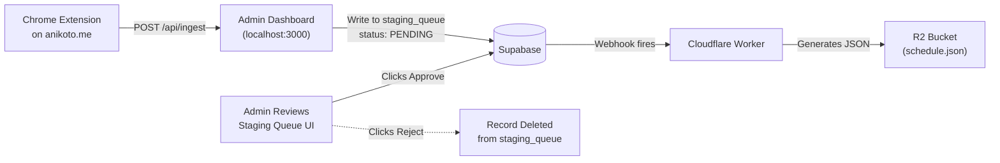

# 10. Data Aggregation & Scraping Strategy

> **Cross-References:** Admin review pipeline → [06 — Admin Stories](./06_user_stories_admin.md) · Staging Queue schema → [03 — Architecture](./03_technical_architecture.md#table-staging_queue-admin-only).

## 10.1 The Decision: Chrome Extension vs. Python Scraper

Both approaches were evaluated. This section documents the analysis and final recommendation.

### 10.1.1 Comparison Matrix

| Factor | Chrome Extension | Python Scraper (BeautifulSoup/Playwright) |
|:---|:---|:---|
| **Cloudflare Bot Protection** | ✅ Bypassed (runs in real browser session) | ❌ Often blocked (detected as bot) |
| **CAPTCHAs** | ✅ Bypassed (user is logged in, human session) | ❌ Requires CAPTCHA-solving services ($) |
| **JavaScript-Rendered Content** | ✅ Full DOM available (post-render) | 🟡 Requires Playwright/Selenium (heavy) |
| **Setup Complexity** | Low (install extension, click button) | High (install Python, pip, configure env) |
| **Portability** | Requires Chrome browser | Runs on any machine, including servers |
| **Automation** | ❌ Manual trigger (admin must click) | ✅ Can be scheduled via CRON |
| **Scalability** | ❌ One site at a time, manual | ✅ Can scrape 50 sites in parallel |
| **Maintenance** | Update CSS selectors in config JSON | Update CSS selectors in Python code |
| **Cost** | Free | Free (but may need proxies for blocked sites) |

### 10.1.2 Recommendation: Chrome Extension (Primary) + Python Scraper (Fallback)

**Primary Tool: Chrome Extension.** Since the Admin manually runs scrapers only 2-3 times per week (at the start of each anime season + weekly news updates), the Chrome Extension is the clear winner. It eliminates all anti-bot issues, requires no infrastructure, and is trivially simple to operate.

**Fallback Tool: Python Scraper.** For sites that have a clean, unprotected HTML structure (e.g., static news sites, RSS feeds), a simple Python script using `requests` + `BeautifulSoup` can batch-extract articles faster. This is a *secondary* tool, not the primary pipeline.

---

## 10.2 Chrome Extension Architecture

### 10.2.1 Extension Structure
```
anipulse-scraper-extension/
├── manifest.json          # Chrome Extension manifest (Manifest V3)
├── popup.html             # Small popup UI with "Extract Schedule" / "Extract News" buttons
├── popup.js               # Button click handlers
├── content_scripts/
│   ├── anikoto_schedule.js   # DOM extractor for anikoto.me schedule page
│   ├── ann_news.js           # DOM extractor for AnimeNewsNetwork articles
│   └── crunchyroll_news.js   # DOM extractor for Crunchyroll news page
├── config/
│   └── selectors.json        # Configurable CSS selectors (update without code changes)
└── utils/
    └── api.js                # POST helper to send payloads to Admin Dashboard
```

### 10.2.2 Configurable Selectors (`selectors.json`)
When a target site changes its HTML layout, update this file—no code changes needed.

```json
{
  "anikoto_schedule": {
    "card_container": ".anime-schedule-card",
    "title_en": ".card-title-en",
    "title_jp": ".card-title-jp",
    "air_time": ".card-air-time",
    "cover_img": ".card-poster img",
    "studio": ".card-studio",
    "episode_number": ".card-episode-num"
  },
  "animenewsnetwork_news": {
    "article_container": ".news-article",
    "headline": ".article-title a",
    "body": ".article-body p:first-child",
    "image": ".article-image img",
    "published_date": ".article-date time"
  }
}
```

### 10.2.3 Content Script Logic (Schedule Extraction)
```javascript
// content_scripts/anikoto_schedule.js
// Injected into anikoto.me/home when admin clicks "Extract Schedule"

(async () => {
    const config = await fetch(chrome.runtime.getURL('config/selectors.json')).then(r => r.json());
    const sel = config.anikoto_schedule;

    const cards = document.querySelectorAll(sel.card_container);
    const payload = [];

    cards.forEach(card => {
        const titleEn = card.querySelector(sel.title_en)?.innerText?.trim() || 'UNKNOWN';
        const titleJp = card.querySelector(sel.title_jp)?.innerText?.trim() || '';
        const airTime = card.querySelector(sel.air_time)?.innerText?.trim() || '';
        const coverUrl = card.querySelector(sel.cover_img)?.src || '';
        const studio = card.querySelector(sel.studio)?.innerText?.trim() || '';
        const epNum = parseInt(card.querySelector(sel.episode_number)?.innerText?.replace(/\D/g, '')) || 0;

        payload.push({
            title_en: titleEn,
            title_jp: titleJp,
            air_time_raw: airTime,   // Will be parsed to UTC by Admin backend
            cover_url: coverUrl,
            studio: studio,
            episode_number: epNum,
            source: 'anikoto.me',
            extracted_at: new Date().toISOString()
        });
    });

    // Send to local Admin Dashboard
    const response = await fetch('http://localhost:3000/api/ingest', {
        method: 'POST',
        headers: { 'Content-Type': 'application/json' },
        body: JSON.stringify({ type: 'schedule', items: payload })
    });

    const result = await response.json();
    alert(`✅ AniPulse: Extracted ${payload.length} shows. ${result.new} new, ${result.updated} updated.`);
})();
```

### 10.2.4 Content Script Logic (News Extraction)
```javascript
// content_scripts/ann_news.js
// Injected into animenewsnetwork.com when admin clicks "Extract News"

(async () => {
    const config = await fetch(chrome.runtime.getURL('config/selectors.json')).then(r => r.json());
    const sel = config.animenewsnetwork_news;

    const articles = document.querySelectorAll(sel.article_container);
    const payload = [];

    articles.forEach(article => {
        const headline = article.querySelector(sel.headline)?.innerText?.trim() || '';
        const bodyText = article.querySelector(sel.body)?.innerText?.trim() || '';
        const imageUrl = article.querySelector(sel.image)?.src || '';
        const sourceUrl = article.querySelector(sel.headline)?.href || '';
        const publishedAt = article.querySelector(sel.published_date)?.getAttribute('datetime') || '';

        if (headline) {
            payload.push({
                headline,
                body_summary: bodyText.substring(0, 500),
                image_url: imageUrl,
                source_name: 'AnimeNewsNetwork',
                source_url: sourceUrl,
                published_at: publishedAt,
                extracted_at: new Date().toISOString()
            });
        }
    });

    const response = await fetch('http://localhost:3000/api/ingest', {
        method: 'POST',
        headers: { 'Content-Type': 'application/json' },
        body: JSON.stringify({ type: 'news', items: payload })
    });

    const result = await response.json();
    alert(`✅ AniPulse: Extracted ${payload.length} news articles.`);
})();
```

---

## 10.3 The Admin Review Pipeline (Staging Queue)

Data extracted from the web is **never** pushed directly to production. The pipeline enforces human review.

### 10.3.1 The Complete Data Flow



### 10.3.2 The Staging Queue UI (`/queue` page in Admin Dashboard)

| Column in Table | Source | Visual Treatment |
|:---|:---|:---|
| **Title** | Scraped `title_en` | Bold text. If title already exists in DB, show "UPDATE" badge. If new, show "NEW" badge in green. |
| **Air Time (Raw)** | Scraped `air_time_raw` | Displayed as-is from the source site. |
| **Air Time (Parsed UTC)** | Backend converts raw → UTC | Shown in grey beside raw time for admin verification. |
| **Cover Art** | Scraped `cover_url` | Thumbnail preview. Admin can replace with local upload. |
| **Visual Diff** | Compared to existing DB record | Old values struck through in red. New values highlighted in green. If no existing record, entire row is green "NEW". |
| **Actions** | — | `[✅ Approve]` `[✏️ Edit]` `[❌ Reject]` |

### 10.3.3 Approval Actions
*   **Approve:** Inserts/updates the record in `anime_series` and/or `broadcast_schedule`. Marks `staging_queue.status = 'approved'`. Triggers the Cloudflare Webhook.
*   **Edit:** Opens a pre-filled form allowing the admin to correct any field before saving.
*   **Reject:** Marks `staging_queue.status = 'rejected'`. Record is soft-deleted (kept for audit trail).

---

## 10.4 Python Scraper (Fallback Tool)

For unprotected static sites or RSS feeds, a simple Python script is faster.

### 10.4.1 When to Use Python Instead of the Extension
*   The target site is a simple HTML/RSS page with no Cloudflare protection.
*   You need to batch-extract 100+ articles at once (e.g., back-filling historical news).
*   You want to schedule a CRON job for truly automated extraction (only for trusted, stable sites).

### 10.4.2 Example Python Script (RSS News)
```python
# scraper/rss_news_fetcher.py
import feedparser
import requests
import json

RSS_FEEDS = {
    "AnimeNewsNetwork": "https://www.animenewsnetwork.com/all/rss.xml",
    "CrunchyrollNews": "https://www.crunchyroll.com/feed/news",
}

ADMIN_ENDPOINT = "http://localhost:3000/api/ingest"

def fetch_news():
    payload = []
    for source_name, url in RSS_FEEDS.items():
        feed = feedparser.parse(url)
        for entry in feed.entries[:20]:  # Latest 20 per source
            payload.append({
                "headline": entry.title,
                "body_summary": entry.get("summary", "")[:500],
                "source_name": source_name,
                "source_url": entry.link,
                "image_url": "",  # RSS often lacks images; admin adds manually
                "published_at": entry.get("published", ""),
                "extracted_at": None,
            })

    response = requests.post(
        ADMIN_ENDPOINT,
        json={"type": "news", "items": payload},
        headers={"Content-Type": "application/json"}
    )
    print(f"Sent {len(payload)} articles. Response: {response.status_code}")

if __name__ == "__main__":
    fetch_news()
```

---

## 10.5 Target Sites & Extraction Map

| Source Site | Data Type | Tool | Frequency | Notes |
|:---|:---|:---|:---|:---|
| `anikoto.me/home` | Schedule (airing times, shows) | Chrome Extension | Once per season start + weekly updates | Primary schedule source |
| `livechart.me` | Schedule (fallback/verification) | Chrome Extension | As needed | Cross-reference to verify Anikoto data |
| `myanimelist.net` | Anime metadata (synopsis, genres, scores) | Chrome Extension | Once per new show added | Used for enriching data |
| `animenewsnetwork.com` | News articles | Chrome Extension OR Python RSS | 2-3 times per week | RSS feed available as fallback |
| `crunchyroll.com/news` | News articles | Chrome Extension | 2-3 times per week | Often has exclusive announcements |
| `twitter.com / x.com` | Breaking news, PV drops | Manual (copy-paste into Admin) | As breaking news occurs | Not scrapable; admin copies manually |
