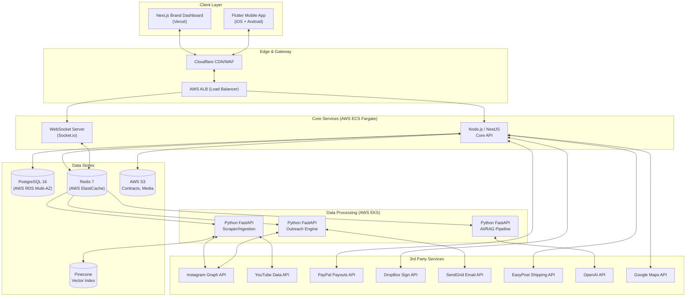

# 3. Technical Architecture, Database Schema & Infrastructure

> **Cross-References:** For the features these services power, see [02 — Features](./02_core_features.md). For security NFRs, see [10 — NFRs](./10_nfr_and_compliance.md). For the state machine these tables support, see [08 — Business Rules](./08_business_rules_and_rbac.md).

---

## 3.1 High-Level System Architecture

---

## 3.2 Service Catalog

| Service Name | Technology | Hosting | Port | Responsibility | Scales On |
|:---|:---|:---|:---|:---|:---|
| `euka-api` | Node.js 20 / NestJS | AWS ECS Fargate | 3000 | Auth, RBAC, CRUD, Financial Ledger, Webhooks | CPU > 70% |
| `euka-ws` | Node.js / Socket.io | AWS ECS Fargate | 3001 | Real-time Kanban updates, Leaderboard pushes | Connection count > 500 |
| `euka-web` | Next.js 14 (App Router) | Vercel | 443 | Brand Dashboard SSR & CSR | Vercel auto |
| `euka-scraper` | Python 3.12 / FastAPI | AWS EKS | 8001 | Headless browser scraping, data normalization | Queue depth > 100 |
| `euka-outreach` | Python 3.12 / Celery | AWS EKS | 8002 | DM/Email sending, rate limiting, proxy mgmt | Queue depth > 50 |
| `euka-ai` | Python 3.12 / FastAPI | AWS EKS | 8003 | LLM calls (RAG, Trend Analysis, Vision scoring) | Queue depth > 20 |
| `euka-mobile` | Flutter 3.x / Dart | App Store + Play Store | — | Creator-facing native mobile app | N/A |

---

## 3.3 Complete Database Schema (PostgreSQL 16)
*All UUIDs use `gen_random_uuid()`. All timestamps use `TIMESTAMPTZ` with `DEFAULT NOW()`. All monetary values use `NUMERIC(12,2)` — never `FLOAT`.*

### Table: `brands`
| Column | Type | Constraints | Index | Notes |
|:---|:---|:---|:---|:---|
| `id` | UUID | PK | — | |
| `company_name` | VARCHAR(255) | NOT NULL | — | |
| `industry` | VARCHAR(100) | | — | For analytics segmentation |
| `stripe_customer_id` | VARCHAR(255) | UNIQUE | btree | Billing |
| `subscription_tier` | ENUM('STARTER','GROWTH','ENTERPRISE') | DEFAULT 'STARTER' | — | Maps to [pricing tiers](./01_project_overview_and_market.md#saas-pricing-tiers-brand-side) |
| `daily_dm_limit` | INTEGER | NOT NULL, DEFAULT 200 | — | Derived from tier |
| `created_at` | TIMESTAMPTZ | DEFAULT NOW() | — | |
| `updated_at` | TIMESTAMPTZ | DEFAULT NOW() | — | Trigger on update |

### Table: `users`
| Column | Type | Constraints | Index | Notes |
|:---|:---|:---|:---|:---|
| `id` | UUID | PK | — | |
| `brand_id` | UUID | FK → `brands.id`, NULLABLE | btree | NULL = Creator-type user |
| `role` | ENUM('SUPERADMIN','MEMBER','VIEWER','CREATOR') | NOT NULL | — | Maps to [RBAC](./08_business_rules_and_rbac.md#81-rbac-role-based-access-control-permission-matrix) |
| `email` | VARCHAR(255) | UNIQUE, NOT NULL | btree | Login credentials |
| `password_hash` | VARCHAR(255) | | — | Argon2id (see [NFR-SEC003](./10_nfr_and_compliance.md)) |
| `two_factor_secret` | VARCHAR(255) | | — | AES-256 encrypted TOTP seed |
| `is_active` | BOOLEAN | DEFAULT TRUE | — | Soft-delete flag |
| `last_login_at` | TIMESTAMPTZ | | — | |

### Table: `creators`
| Column | Type | Constraints | Index | Notes |
|:---|:---|:---|:---|:---|
| `id` | UUID | PK | — | |
| `user_id` | UUID | FK → `users.id`, UNIQUE | btree | Auth link |
| `instagram_handle` | VARCHAR(100) | UNIQUE | pg_trgm GIN | Supports `ILIKE '%query%'` fast search |
| `youtube_channel_id` | VARCHAR(100) | UNIQUE, NULLABLE | btree | Omnichannel |
| `platform` | ENUM('INSTAGRAM','YOUTUBE','AMAZON') | NOT NULL | — | Primary platform |
| `niche` | VARCHAR(50) | | btree | E.g., 'Beauty', 'Tech' |
| `follower_count` | INTEGER | DEFAULT 0 | btree | Sortable |
| `engagement_rate` | NUMERIC(5,2) | | btree | Sortable |
| `gmv_30_day` | NUMERIC(15,2) | DEFAULT 0 | btree | Critical filter |
| `ai_quality_score` | NUMERIC(3,1) | | btree | 1.0 — 10.0 scale from Vision AI |
| `trust_flag` | ENUM('TRUSTED','NEW','UNRELIABLE') | DEFAULT 'NEW' | — | Set by [EC-09](./02_core_features.md) |
| `paypal_email` | VARCHAR(255) | | — | For PayPal Payouts |
| `lifetime_earnings` | NUMERIC(12,2) | DEFAULT 0 | — | Derived, denormalized for fast display |
| `available_balance` | NUMERIC(12,2) | DEFAULT 0 | — | Derived, denormalized; verified via ledger SUM on withdrawal |
| `address_json_encrypted` | TEXT | | — | AES-256-GCM encrypted JSON (see [NFR-SEC002](./10_nfr_and_compliance.md)) |
| `tier` | ENUM('FREE','VIP') | DEFAULT 'FREE' | — | Maps to [Creator RBAC](./08_business_rules_and_rbac.md#creator-app-permissions) |
| `referred_by` | UUID | FK → `creators.id`, NULLABLE | — | Referral graph |
| `created_at` | TIMESTAMPTZ | DEFAULT NOW() | — | |

### Table: `campaigns`
| Column | Type | Constraints | Index | Notes |
|:---|:---|:---|:---|:---|
| `id` | UUID | PK | — | |
| `brand_id` | UUID | FK → `brands.id`, NOT NULL | btree | Tenant isolation |
| `title` | VARCHAR(255) | NOT NULL | — | |
| `type` | ENUM('COLLAB','RETAINER','CONTEST','AMAZON') | NOT NULL | — | Maps to Creator feed filter pills |
| `product_name` | VARCHAR(255) | | — | |
| `commission_rate` | NUMERIC(5,2) | | — | E.g., 20.00 for 20% |
| `budget_cap` | NUMERIC(12,2) | | — | Max spend |
| `budget_spent` | NUMERIC(12,2) | DEFAULT 0 | — | Updated on each payout |
| `status` | ENUM('DRAFT','ACTIVE','PAUSED','COMPLETED') | DEFAULT 'DRAFT' | btree | |
| `created_at` | TIMESTAMPTZ | DEFAULT NOW() | — | |

### Table: `contests`
| Column | Type | Constraints | Index | Notes |
|:---|:---|:---|:---|:---|
| `id` | UUID | PK | — | |
| `campaign_id` | UUID | FK → `campaigns.id`, UNIQUE | btree | 1:1 with a CONTEST campaign |
| `prize_pool` | NUMERIC(12,2) | NOT NULL | — | Must be escrowed (Rule [CR-001](./08_business_rules_and_rbac.md)) |
| `stripe_escrow_pi_id` | VARCHAR(255) | | — | Stripe PaymentIntent for escrow |
| `start_date` | TIMESTAMPTZ | NOT NULL | — | |
| `end_date` | TIMESTAMPTZ | NOT NULL | — | |
| `min_participants` | INTEGER | DEFAULT 3 | — | Rule [CR-003](./08_business_rules_and_rbac.md) |
| `rules_json` | JSONB | | — | E.g., `{"type": "sales", "tiers": [{"min": 100, "prize": 100}]}` |
| `status` | ENUM('DRAFT','SCHEDULED','ACTIVE','CLOSING','ENDED','PAYOUTS_PROCESSING','COMPLETED','CANCELLED') | | — | Matches [State Machine 8.3](./08_business_rules_and_rbac.md#83-contest-lifecycle-state-machine) |

### Table: `collaborations`
| Column | Type | Constraints | Index | Notes |
|:---|:---|:---|:---|:---|
| `id` | UUID | PK | — | |
| `campaign_id` | UUID | FK → `campaigns.id` | btree | |
| `creator_id` | UUID | FK → `creators.id` | btree | |
| `current_stage` | VARCHAR(50) | DEFAULT 'SCOUTED' | btree | Valid values: SCOUTED, CONTACTED, REPLIED, NEGOTIATING, CONTRACT_SENT, CONTRACT_SIGNED, ADDRESS_RECEIVED, SAMPLE_PROCESSING, SAMPLE_SHIPPED, SAMPLE_DELIVERED, NUDGE_SENT, VIDEO_SUBMITTED, VIDEO_APPROVED, VIDEO_REJECTED, VIDEO_LIVE, PAYMENT_PENDING, PAID, ARCHIVED, NO_REPLY, BLACKLISTED, HANDLE_INVALID, SHIPPING_EXCEPTION. See [State Machine 8.2](./08_business_rules_and_rbac.md#82-collaboration-state-machine) |
| `stage_entered_at` | TIMESTAMPTZ | DEFAULT NOW() | — | Reset on every transition; used for ⚠️ badge (>7 days stale) |
| `shopify_order_id` | VARCHAR(100) | NULLABLE | — | |
| `tracking_number` | VARCHAR(100) | NULLABLE | — | |
| `carrier` | VARCHAR(50) | NULLABLE | — | E.g., 'USPS', 'UPS', 'FedEx' |
| `video_url` | VARCHAR(500) | NULLABLE | — | Creator-submitted Instagram Reel / YouTube Shorts link |
| `revenue_generated` | NUMERIC(12,2) | DEFAULT 0 | — | Attribution sum |
| `contract_id` | UUID | FK → `contracts.id`, NULLABLE | — | |
| `created_at` | TIMESTAMPTZ | DEFAULT NOW() | — | |

### Table: `contracts`
| Column | Type | Constraints | Index | Notes |
|:---|:---|:---|:---|:---|
| `id` | UUID | PK | — | |
| `brand_id` | UUID | FK → `brands.id` | btree | |
| `creator_id` | UUID | FK → `creators.id` | btree | |
| `type` | ENUM('COLLAB_AGREEMENT','USAGE_RIGHTS','RETAINER_AGREEMENT') | | — | |
| `document_url` | VARCHAR(500) | | — | S3 URL |
| `document_hash` | VARCHAR(64) | | — | SHA-256 hex digest for tamper-proof verification |
| `dropbox_sign_request_id` | VARCHAR(255) | | — | External tracking |
| `is_signed` | BOOLEAN | DEFAULT FALSE | — | Flipped by webhook |
| `signed_at` | TIMESTAMPTZ | NULLABLE | — | |

### Table: `ledger_transactions`
*⚠️ APPEND-ONLY. DB trigger rejects UPDATE/DELETE. See rule [FR-001](./08_business_rules_and_rbac.md#84-financial-ledger-business-rules).*

| Column | Type | Constraints | Index | Notes |
|:---|:---|:---|:---|:---|
| `id` | UUID | PK | — | |
| `creator_id` | UUID | FK → `creators.id` | btree | |
| `collaboration_id` | UUID | FK → `collaborations.id`, NULLABLE | — | NULL for bonuses/adjustments |
| `amount` | NUMERIC(12,2) | NOT NULL | — | Positive = credit; Negative = debit/adjustment |
| `type` | ENUM('EARNED','WITHDRAWN','BONUS','ADJUSTMENT','PLATFORM_FEE') | NOT NULL | — | |
| `status` | ENUM('PENDING','CLEARED','PROCESSING','FAILED') | NOT NULL | — | |
| `idempotency_key` | VARCHAR(255) | UNIQUE | btree | Prevents double payouts (rule [FR-004](./08_business_rules_and_rbac.md)) |
| `payout_method` | ENUM('PAYPAL','STRIPE','MANUAL') | NULLABLE | — | |
| `paypal_payout_item_id` | VARCHAR(255) | NULLABLE | — | External ref for reconciliation |
| `notes` | TEXT | NULLABLE | — | E.g., "Commission for video XYZ" |
| `created_at` | TIMESTAMPTZ | DEFAULT NOW() | btree | Immutable |

### Table: `outreach_logs`
| Column | Type | Constraints | Index | Notes |
|:---|:---|:---|:---|:---|
| `id` | UUID | PK | — | |
| `brand_id` | UUID | FK → `brands.id` | btree | For daily counter |
| `creator_id` | UUID | FK → `creators.id` | btree | |
| `campaign_id` | UUID | FK → `campaigns.id` | btree | |
| `channel` | ENUM('INSTAGRAM_DM','EMAIL','INSTAGRAM_COLLAB_INVITE') | | — | |
| `message_content` | TEXT | | — | Stored for audit/A/B analysis |
| `variant_id` | VARCHAR(50) | NULLABLE | — | A/B test variant |
| `status` | ENUM('PENDING','SENT','DELIVERED','FAILED','RATE_LIMITED') | | btree | |
| `sent_at` | TIMESTAMPTZ | NULLABLE | btree | Used for 48hr duplicate check |
| `replied_at` | TIMESTAMPTZ | NULLABLE | — | |

### Table: `trending_keywords`
| Column | Type | Constraints | Index | Notes |
|:---|:---|:---|:---|:---|
| `id` | UUID | PK | — | |
| `keyword` | VARCHAR(255) | NOT NULL | btree | |
| `platform` | ENUM('INSTAGRAM','AMAZON') | NOT NULL | — | |
| `gmv_7d` | NUMERIC(15,2) | | — | |
| `sales_7d` | INTEGER | | — | |
| `trend_direction` | ENUM('UP','DOWN','STABLE') | | — | |
| `ai_analysis_cache` | JSONB | NULLABLE | — | Cached LLM response; TTL managed application-side |
| `scraped_at` | TIMESTAMPTZ | DEFAULT NOW() | — | |

### Table: `audit_events`
*Immutable audit trail. See [NFR-SEC011](./10_nfr_and_compliance.md).*

| Column | Type | Constraints | Index | Notes |
|:---|:---|:---|:---|:---|
| `id` | UUID | PK | — | |
| `user_id` | UUID | FK → `users.id` | btree | Who performed the action |
| `entity_type` | VARCHAR(50) | NOT NULL | — | E.g., 'collaboration', 'contract', 'ledger' |
| `entity_id` | UUID | NOT NULL | btree | |
| `action` | VARCHAR(50) | NOT NULL | — | E.g., 'STAGE_CHANGED', 'PAYOUT_INITIATED' |
| `old_value` | JSONB | NULLABLE | — | |
| `new_value` | JSONB | NULLABLE | — | |
| `ip_address` | INET | | — | |
| `created_at` | TIMESTAMPTZ | DEFAULT NOW() | btree | |

### Table: `campaign_sequences`
*Stores the serialized Drip Campaign flow for each campaign. See [Screen 7.5](./07_screen_specifications.md).*

| Column | Type | Constraints | Index | Notes |
|:---|:---|:---|:---|:---|
| `id` | UUID | PK | — | |
| `campaign_id` | UUID | FK → `campaigns.id`, UNIQUE | btree | 1:1 per campaign |
| `flow_json` | JSONB | NOT NULL | — | Serialized React Flow DAG |
| `is_active` | BOOLEAN | DEFAULT FALSE | — | Toggled by Activate switch |
| `created_at` | TIMESTAMPTZ | DEFAULT NOW() | — | |
| `updated_at` | TIMESTAMPTZ | DEFAULT NOW() | — | |

### Table: `contest_participants`
*Tracks which creators have joined which contests. See [Story 4.3](./04_user_stories.md) and [Screen 7.8](./07_screen_specifications.md).*

| Column | Type | Constraints | Index | Notes |
|:---|:---|:---|:---|:---|
| `id` | UUID | PK | — | |
| `contest_id` | UUID | FK → `contests.id` | btree | |
| `creator_id` | UUID | FK → `creators.id` | btree | |
| `joined_at` | TIMESTAMPTZ | DEFAULT NOW() | — | |
| CONSTRAINT | | UNIQUE(`contest_id`, `creator_id`) | | Prevent duplicate joins |

### Table: `opt_out_list`
*Creators who have opted out of receiving DMs. See rule [OR-006](./08_business_rules_and_rbac.md#85-outreach-safety-business-rules).*

| Column | Type | Constraints | Index | Notes |
|:---|:---|:---|:---|:---|
| `id` | UUID | PK | — | |
| `creator_id` | UUID | FK → `creators.id` | btree | |
| `brand_id` | UUID | FK → `brands.id`, NULLABLE | btree | NULL = global opt-out; otherwise brand-specific |
| `reason` | VARCHAR(255) | | — | E.g., "Creator replied STOP" |
| `created_at` | TIMESTAMPTZ | DEFAULT NOW() | — | |

### Table: `notifications`
*Stores in-app notifications for the bell icon UI. See [09 — Notification Center](./09_notifications_and_emails.md#94-in-app-notification-center-bell-icon).*

| Column | Type | Constraints | Index | Notes |
|:---|:---|:---|:---|:---|
| `id` | UUID | PK | — | |
| `user_id` | UUID | FK → `users.id` | btree | Recipient |
| `type` | VARCHAR(50) | NOT NULL | — | E.g., `DEAL_AVAILABLE`, `APPLICATION_ACCEPTED`, `PAYMENT_RECEIVED` |
| `title` | VARCHAR(255) | NOT NULL | — | Display title |
| `body` | TEXT | | — | Display body |
| `deep_link` | VARCHAR(500) | NULLABLE | — | In-app navigation target |
| `is_read` | BOOLEAN | DEFAULT FALSE | btree | For unread badge count |
| `created_at` | TIMESTAMPTZ | DEFAULT NOW() | btree | Sorted reverse-chronological |

---

## 3.4 API Route Map

| Method | Path | Service | Auth | Description | Synced With |
|:---|:---|:---|:---|:---|:---|
| POST | `/api/v1/auth/register` | euka-api | Public | Brand registration | Screen [7.1](./07_screen_specifications.md) |
| POST | `/api/v1/auth/login` | euka-api | Public | Login | Screen [7.1](./07_screen_specifications.md) |
| GET | `/api/v1/dashboard/kpis` | euka-api | Brand | KPI metrics | Screen [7.2](./07_screen_specifications.md) |
| GET | `/api/v1/creators/search` | euka-api | Brand | Explorer query | Screen [7.3](./07_screen_specifications.md) |
| POST | `/api/v1/creators/lookalike` | euka-ai | Brand | Vector similarity search | Feature [2.1.2](./02_core_features.md) |
| GET | `/api/v1/campaigns/:id/board` | euka-api | Brand | Kanban data | Screen [7.4](./07_screen_specifications.md) |
| PATCH | `/api/v1/collaborations/:id` | euka-api | Brand | Stage transition | State Machine [8.2](./08_business_rules_and_rbac.md) |
| PUT | `/api/v1/campaigns/:id/sequence` | euka-api | Brand | Save drip campaign flow | Screen [7.5](./07_screen_specifications.md) |
| POST | `/api/v1/auth/creator/magic-link` | euka-api | Public | Send magic link | Screen [7.6](./07_screen_specifications.md) |
| GET | `/api/v1/creators/feed` | euka-api | Creator | Opportunity feed | Screen [7.7](./07_screen_specifications.md) |
| GET | `/api/v1/contests/:id/leaderboard` | euka-api | Creator | Leaderboard | Screen [7.8](./07_screen_specifications.md) |
| GET | `/api/v1/creators/my-work` | euka-api | Creator | My Work tabs | Screen [7.9](./07_screen_specifications.md) |
| GET | `/api/v1/trends` | euka-ai | Creator | Trending keywords | Screen [7.10](./07_screen_specifications.md) |
| POST | `/api/v1/trends/:id/ai-analysis` | euka-ai | Creator | LLM trend insight | Feature [2.4.4](./02_core_features.md) |
| POST | `/api/v1/payouts/withdraw` | euka-api | Creator | PayPal payout | Screen [7.11](./07_screen_specifications.md) |
| POST | `/api/webhooks/easypost` | euka-api | Webhook | Carrier status | Feature [2.3.2](./02_core_features.md) |
| POST | `/api/webhooks/dropbox-sign` | euka-api | Webhook | E-signature events | Feature [2.4.2](./02_core_features.md) |
| POST | `/api/webhooks/paypal` | euka-api | Webhook | Payout confirmation | Rule [FR-001](./08_business_rules_and_rbac.md) |
| POST | `/api/webhooks/stripe` | euka-api | Webhook | Subscription billing | |
| POST | `/api/v1/auth/forgot-password` | euka-api | Public | Send password reset link | Screen [7.1c](./07_screen_specifications.md) |
| POST | `/api/v1/auth/reset-password` | euka-api | Public | Reset password via token | Screen [7.1c](./07_screen_specifications.md) |
| GET | `/api/v1/auth/check-email` | euka-api | Public | Check email uniqueness | Screen [7.1b](./07_screen_specifications.md) |
| GET | `/api/v1/brands/team` | euka-api | SuperAdmin | List team members | Screen [7.12](./07_screen_specifications.md) |
| POST | `/api/v1/brands/team/invite` | euka-api | SuperAdmin | Send team invitation | Screen [7.12](./07_screen_specifications.md) |
| GET | `/api/v1/brands/billing` | euka-api | SuperAdmin | Billing info + invoices | Screen [7.13](./07_screen_specifications.md) |
| GET | `/api/v1/analytics` | euka-api | Brand | Analytics data | Screen [7.14](./07_screen_specifications.md) |
| GET | `/api/v1/analytics/export` | euka-api | Brand | CSV export | Story [6.2](./04_user_stories.md) |
| POST | `/api/v1/creators/apply` | euka-api | Creator | Apply to a campaign | Screen [7.7](./07_screen_specifications.md) |
| POST | `/api/v1/contests/:id/join` | euka-api | Creator | Join a contest | Screen [7.8](./07_screen_specifications.md) |
| GET | `/api/v1/notifications` | euka-api | Any | Paginated notification list | [Notification Center](./09_notifications_and_emails.md) |
| PATCH | `/api/v1/notifications/read` | euka-api | Any | Mark notifications as read | [Notification Center](./09_notifications_and_emails.md) |
| DELETE | `/api/v1/me` | euka-api | Any | GDPR: cascade-delete all PII | [Compliance](./01_project_overview_and_market.md) |
| GET | `/api/v1/creators/:id/profile` | euka-api | Brand | Creator detail for side panel | Screen [7.4](./07_screen_specifications.md) |
| PUT | `/api/v1/creators/address` | euka-api | Creator | Update shipping address | Screen [7.11](./07_screen_specifications.md) |
| PUT | `/api/v1/creators/notifications` | euka-api | Creator | Update notification preferences | Screen [7.11](./07_screen_specifications.md) |
| POST | `/api/v1/collaborations/:id/video` | euka-api | Creator | Submit video URL | Screen [7.9](./07_screen_specifications.md) |
| POST | `/api/v1/collaborations/:id/approve` | euka-api | Brand | Approve submitted video | Screen [7.4](./07_screen_specifications.md) |
| POST | `/api/v1/collaborations/:id/reject` | euka-api | Brand | Reject submitted video | Screen [7.4](./07_screen_specifications.md) |

---

## 3.5 Security & Cryptography Standards
*Synced with [10 — NFRs](./10_nfr_and_compliance.md#104-security-requirements).*

| Domain | Standard | Implementation Detail |
|:---|:---|:---|
| PII Encryption at Rest | AES-256-GCM | Keys stored in AWS KMS; rotated annually |
| Password Hashing | Argon2id | Memory: 64MB, Iterations: 3, Parallelism: 2 |
| Token Authentication | JWT (Access) + Opaque (Refresh) | Access: 15min TTL, HttpOnly cookie. Refresh: 30-day, stored in `sessions` table |
| CSRF Protection | SameSite=Lax + CSRF Token | Double-submit cookie pattern on all POST/PATCH/DELETE |
| Rate Limiting | Redis sliding window | Auth routes: 100 req/min/IP. Data routes: 500 req/min/IP |
| Idempotency | UUIDv4 header + Redis dedup | 60-second TTL on financial endpoints |
| Audit Trail | Immutable `audit_events` table | Every state change logged with user, IP, old/new values |

---
